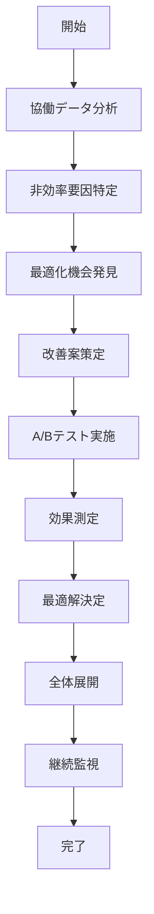

# UC-075: 協働最適化

## 概要

チーム協働プロセスの分析と効果性向上のための最適化。

## アクター

- **プライマリ**: チーム効率化スペシャリスト、プロジェクトマネージャー
- **セカンダリ**: システム（分析エンジン）、チームメンバー

## 前提条件

- [ ] 協働メトリクスが蓄積済み
- [ ] チームパフォーマンスデータが利用可能
- [ ] 最適化目標が明確

## 事後条件

- [ ] 協働プロセスが最適化済み
- [ ] チーム効率が向上済み
- [ ] 最適化効果が測定済み

## 基本フロー



## インターフェース定義

```typescript
interface CollaborationOptimization {
  optimizationId: string;
  teamId: string;
  analysisResults: CollaborationAnalysis;
  optimizationTargets: OptimizationTarget[];
  improvementActions: ImprovementAction[];
  abTestResults: ABTestResult[];
  effectMeasurement: EffectMeasurement;
  implementationStatus: 'PLANNED' | 'TESTING' | 'ROLLING_OUT' | 'COMPLETED';
}

interface CollaborationAnalysis {
  communicationEfficiency: number; // 0-100
  decisionSpeed: number; // average hours
  knowledgeSharingRate: number; // percentage
  conflictResolutionTime: number; // average hours
  memberSatisfaction: number; // 1-5 scale
  productivityIndex: number; // 0-100
}

interface OptimizationTarget {
  area: 'COMMUNICATION' | 'DECISION_MAKING' | 'KNOWLEDGE_SHARING' | 'CONFLICT_RESOLUTION';
  currentValue: number;
  targetValue: number;
  priority: 'HIGH' | 'MEDIUM' | 'LOW';
  timeline: number; // weeks
}
```

## 関連ページ

- **P-050**: 協働最適化ダッシュボード
- **P-051**: A/Bテスト結果表示ページ
- **P-052**: チーム効率分析ページ

## メトリクス

- 協働効率向上: 25%以上
- 意思決定速度改善: 30%以上
- チーム満足度向上: 4.2/5.0以上
- 知識共有頻度増加: 40%以上

## 更新履歴

| バージョン | 更新日 | 更新者 | 更新内容 |
|-----------|--------|---------|----------|
| 1.0 | 2024-11-05 | Claude Code | 初版作成 |