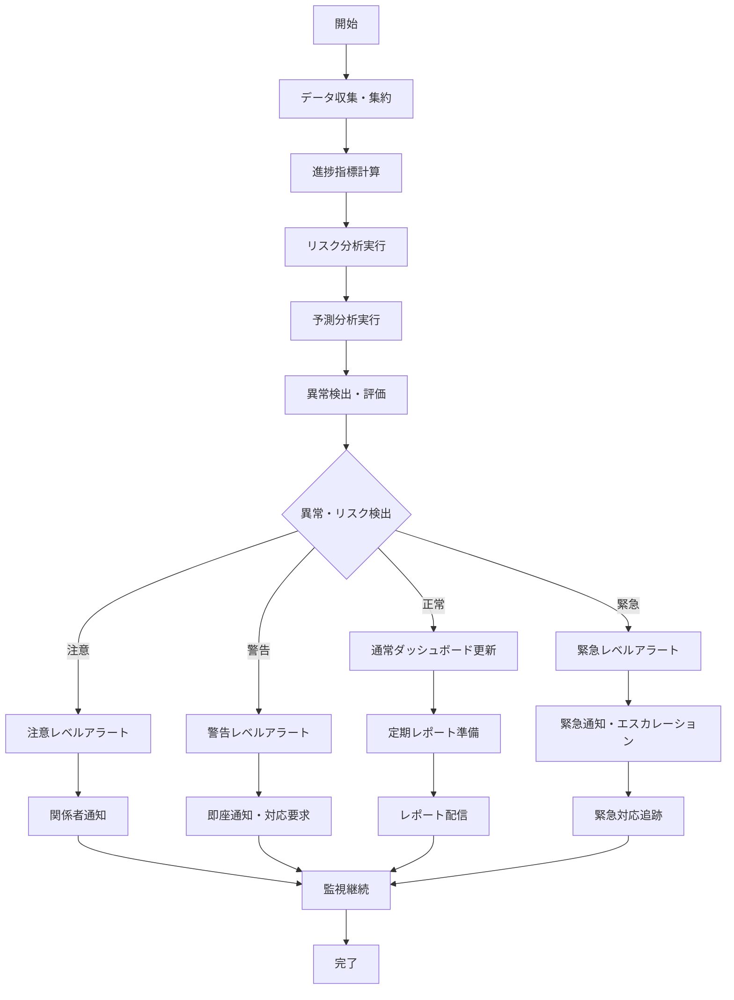
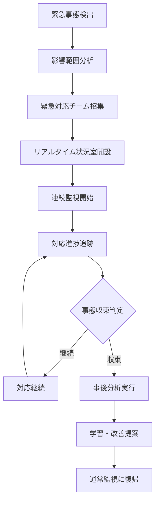
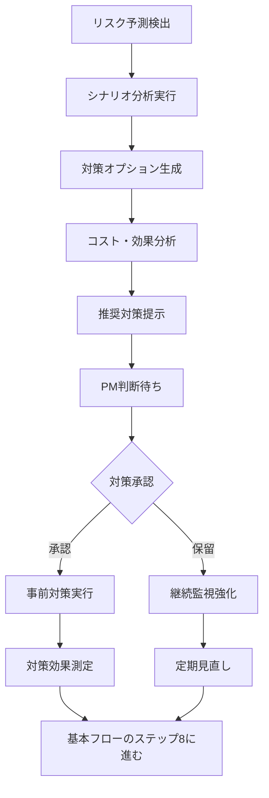
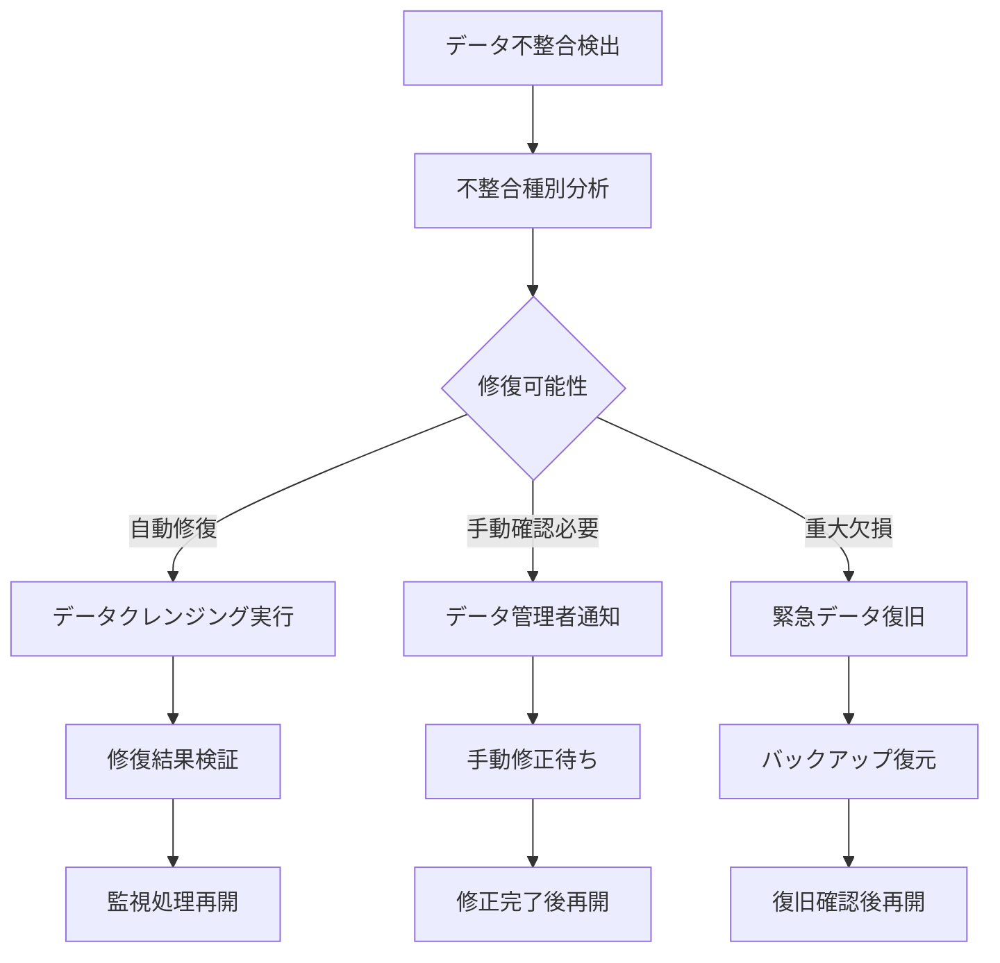
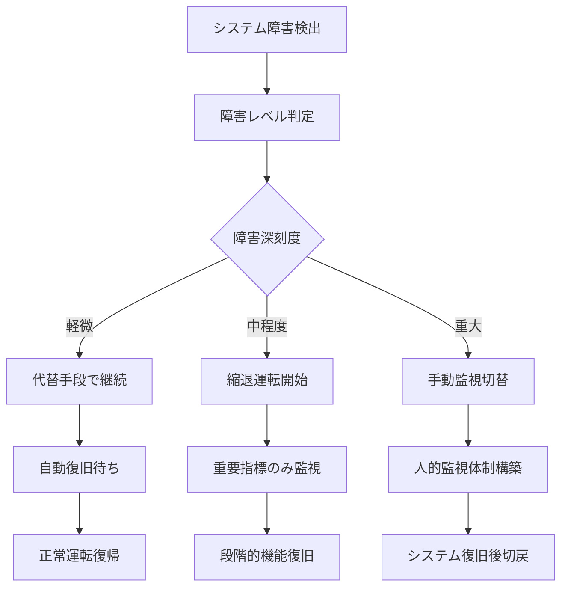

# Operation設計: op-007-monitor-progress

## Operation ID: op-007-monitor-progress

### 基本情報
- **Operation名**: 進捗監視
- **所属Capability**: cap-003-task-monitoring タスク監視能力
- **所属BC**: BC-001 タスク管理
- **操作タイプ**: Query + Command（監視とアラート）
- **ビジネス価値**: プロジェクト全体の進捗を監視し、問題とリスクを早期発見することで、プロジェクト成功率の向上と適切な意思決定を支援する

### 概要
プロジェクト全体の進捗状況をリアルタイムで監視し、計画との乖離、リスク要因、ボトルネックを自動検出する操作。多層的なダッシュボード、智能なアラートシステム、予測分析を通じて、プロジェクトマネージャーと関係者に適切なタイミングで必要な情報を提供し、プロアクティブな問題解決を可能にする。

### 操作の詳細

#### 目的
- プロジェクト全体の健康状態をリアルタイムで把握する
- 計画との乖離とリスク要因を早期に発見する
- ボトルネックと依存関係の問題を特定する
- データ駆動の意思決定を支援する情報を提供する
- ステークホルダーへの透明性のある進捗報告を実現する

#### スコープ
- **含む**:
  - リアルタイム進捗データの収集と集約
  - 多次元での進捗分析（時間・品質・リソース・予算）
  - リスク検出とアラート生成
  - 予測分析と完了予測
  - ダッシュボードとレポートの自動生成
- **含まない**:
  - 個別タスクの詳細進捗管理（op-003で実施）
  - 長期的なパフォーマンス分析（op-008で実施）
  - プロジェクト計画の変更決定（PMの意思決定領域）

#### トリガー
- **リアルタイムトリガー**: タスク状態変更時の自動監視更新
- **スケジュールトリガー**: 定期的な監視レポート生成（日次・週次）
- **閾値トリガー**: 設定された警告値超過時の自動アラート

### ステークホルダー

#### プライマリアクター
- **ロール**: プロジェクトマネージャー、チームリーダー、経営層
- **責任**:
  - 監視データの適切な解釈と判断
  - 検出された問題への迅速な対応
  - ステークホルダーへの透明な情報共有
- **権限**: 監視データへのアクセス権（役割に応じた階層的アクセス）

#### セカンダリアクター
- **自動システム**: アラートシステム、レポート生成システム
- **外部システム**: BIツール、データウェアハウス
- **ステークホルダー**: 顧客、経営層、他部門責任者

#### 受益者
- プロジェクトチーム（早期問題発見）
- 経営層（プロジェクト状況の把握）
- 顧客（進捗の透明性）
- 組織全体（プロジェクト管理の改善）

### プロセスフロー

#### 基本フロー


1. **データ収集・集約**: 各ソースから進捗データを収集
   - 入力: タスクデータ、リソースデータ、時間データ
   - 処理: データ統合、クレンジング、正規化
   - 出力: 統合された進捗データ

2. **進捗指標計算**: 各種進捗指標を計算
   - 入力: 統合データ、計画データ、基準値
   - 処理: KPI計算、進捗率算出、効率性評価
   - 出力: 計算済み指標セット

3. **リスク分析実行**: リスク要因を分析・評価
   - 入力: 進捗指標、履歴データ、設定基準
   - 処理: リスクスコア計算、要因分析、影響度評価
   - 出力: リスク評価結果

4. **予測分析実行**: 将来の進捗を予測
   - 入力: 現在の進捗、過去のトレンド、外部要因
   - 処理: 機械学習による予測、シナリオ分析
   - 出力: 完了予測、リスク予測

5. **異常検出・評価**: 異常とリスクレベルを判定
   - 入力: 指標、リスク評価、予測結果
   - 処理: 閾値比較、パターン認識、総合判定
   - 出力: 異常レベルと詳細情報

6. **アラート生成・通知**: レベルに応じた通知実行
   - 入力: 異常レベル、関係者情報、通知設定
   - 処理: メッセージ作成、配信先決定、通知実行
   - 出力: 送信完了確認

7. **ダッシュボード更新**: リアルタイムダッシュボード更新
   - 入力: 最新指標、アラート情報
   - 処理: 視覚化データ準備、チャート更新
   - 出力: 更新されたダッシュボード

8. **定期レポート生成**: 構造化されたレポート作成
   - 入力: 期間データ、テンプレート、配信設定
   - 処理: レポート生成、フォーマット調整
   - 出力: 配信可能なレポート

#### 代替フロー1: 緊急事態対応モード


- **分岐点**: 基本フロー ステップ5（異常検出・評価）
- **条件**: 緊急レベルのリスクまたは重大な問題が検出された場合

**代替手順**:
1. 緊急事態の影響範囲と深刻度を詳細分析
2. 事前定義された緊急対応チームを自動招集
3. リアルタイム監視体制の強化
4. 収束まで連続的な状況追跡と報告

#### 代替フロー2: 予測ベース事前対応


- **分岐点**: 基本フロー ステップ4（予測分析実行）
- **条件**: 将来のリスクが高確率で予測された場合

**代替手順**:
1. 予測されるリスクの詳細シナリオを分析
2. 事前対策の選択肢を複数生成
3. 各対策のコストと効果を比較評価
4. データに基づく推奨案を提示

#### 例外フロー1: データ不整合・欠損


- **発生点**: ステップ1（データ収集・集約）
- **条件**: 必要なデータが取得できない、または整合性に問題がある場合

**例外対応手順**:
1. データ不整合の種類と影響範囲を特定
2. 自動修復可能な場合は即座に処理
3. 重大な問題の場合は手動介入とバックアップ活用
4. データ品質の継続的改善

#### 例外フロー2: 監視システム障害


- **発生点**: 任意のステップ
- **条件**: 監視システム自体に障害が発生した場合

**例外対応手順**:
1. 障害の深刻度と影響範囲を迅速に判定
2. 代替手段やバックアップシステムでの継続
3. 重大障害時は人的な監視体制に緊急切替
4. 段階的な機能復旧と正常運転への復帰

### データ仕様

#### 入力データ
| 項目名 | 型 | 必須 | 説明 | 制約 |
|-------|----|----|------|------|
| projectId | uuid | ○ | 監視対象プロジェクトID | アクティブプロジェクト |
| monitoringScope | enum | ○ | 監視範囲 | Project/Phase/Sprint/Task |
| alertThresholds | object | ○ | アラート閾値設定 | カスタマイズ可能 |
| reportingFrequency | enum | ○ | レポート頻度 | Realtime/Hourly/Daily/Weekly |
| stakeholderGroups | array | ○ | ステークホルダーグループ | 通知先リスト |
| metricsPriority | array | × | 重要指標の優先度 | 最大20指標 |
| customDashboard | object | × | カスタムダッシュボード設定 | 個人設定 |

#### 出力データ
| 項目名 | 型 | 説明 | 備考 |
|-------|----|----|------|
| monitoringSessionId | uuid | 監視セッションID | システム自動生成 |
| overallHealthScore | number | 総合健康スコア | 0-100の評価 |
| progressMetrics | object | 進捗指標群 | 詳細KPIセット |
| riskAssessment | object | リスク評価結果 | リスクレベルと要因 |
| predictions | object | 予測分析結果 | 完了予測等 |
| alerts | array | アクティブアラート | 未解決の警告 |
| dashboardData | object | ダッシュボード表示データ | 可視化用 |
| reportUrl | string | レポートURL | 配信可能なレポート |

#### 内部データ
| 項目名 | 型 | 説明 | ライフサイクル |
|-------|----|----|------------|
| monitoringHistory | array | 監視履歴 | 永続保存 |
| alertHistory | array | アラート履歴 | 分析用保存 |
| predictionAccuracy | object | 予測精度追跡 | 改善用データ |

### ビジネスルール

#### 必須ルール
1. **リアルタイム性**: 重要な変更は5分以内に反映必須
2. **アラート適切性**: 偽陽性を最小化し、真のリスクのみアラート
3. **データ品質**: 不正確なデータに基づく判断を防止
4. **透明性**: 全ての監視ロジックと基準を明確に文書化

#### 制約条件
1. **監視負荷**: システムパフォーマンスへの影響5%以内
2. **データ保持**: 監視データは2年間保持後アーカイブ
3. **アクセス制御**: 役割に応じた情報へのアクセス制限

#### バリデーション
1. **データ整合性**: 収集データの論理的整合性確認
2. **閾値妥当性**: 設定された閾値の合理性確認
3. **予測精度**: 予測モデルの継続的精度検証

### 品質要求

#### パフォーマンス
- **応答時間**: ダッシュボード表示は3秒以内
- **データ更新**: リアルタイムデータは30秒以内で更新
- **大量処理**: 1000タスクのプロジェクト監視を同時処理可能

#### 可用性
- **稼働率**: 99.9%（監視機能の超高可用性要求）
- **災害対策**: 地理的分散バックアップによる継続性確保

#### セキュリティ
- **認証要求**: 多要素認証による厳格なアクセス制御
- **認可要求**: 役割ベースの階層的データアクセス
- **データ保護**: 監視データの暗号化と改ざん防止

### UseCase関連

#### 関連UseCase
| UseCase ID | UseCase名 | 関係 | 説明 |
|-----------|----------|------|------|
| uc-007-progress-monitoring | 進捗監視 | implements | このOperationが直接実現するUseCase |
| uc-009-task-escalation | タスクエスカレーション | triggers | リスク検出時のエスカレーション |
| uc-010-dependency-management | 依存関係管理 | includes | 依存関係監視を含む |

#### 実現するUseCase
- **uc-007-progress-monitoring**: 進捗監視 - PMによるプロジェクト健康状態把握

### 実装指針

#### 技術要求
- **使用技術**: TypeScript, Next.js Server Actions, Prisma ORM
- **フレームワーク**: React Query, Recharts（グラフ可視化）
- **ライブラリ**: date-fns（時間分析）, ml-regression（予測分析）

#### アーキテクチャ
- **パターン**: Observer Pattern（イベント駆動監視）+ CQRS（監視専用DB）
- **層構造**: Presentation → Application → Domain → Infrastructure

#### 実装の考慮事項
1. **時系列データ処理**: InfluxDBまたは類似の時系列DB検討
2. **リアルタイム更新**: WebSocketによる即座の画面更新
3. **機械学習**: 監視パターン学習による予測精度向上

### テスト設計

#### テストシナリオ
1. **正常系テスト**:
   - 通常プロジェクトの継続監視
   - 各種アラートレベルの動作
   - 予測分析の精度検証

2. **異常系テスト**:
   - データ不整合時の動作
   - システム障害時の縮退運転
   - 大量アラート発生時の処理

3. **境界値テスト**:
   - 最大プロジェクト数での監視
   - 閾値ギリギリでのアラート
   - 長期間データでの予測

#### テストデータ
- **正常データセット**: 様々な規模・進捗のプロジェクト
- **異常データセット**: 遅延・品質問題・リソース不足
- **境界値データセット**: 制限値近辺での動作確認

### メトリクス

#### ビジネスメトリクス
- **問題発見率**: 実際の問題に対する事前検出率（目標: 80%以上）
- **対応時間短縮**: 問題発見から対応開始までの時間（目標: 50%短縮）
- **予測精度**: 完了予測の的中率（目標: 85%以上）
- **ステークホルダー満足度**: 監視システムの満足度（目標: 4.5/5.0以上）

#### 技術メトリクス
- **監視遅延**: データ更新からダッシュボード反映までの時間（目標: 30秒以内）
- **システム負荷**: 監視機能による追加負荷（目標: 5%以内）
- **可用性**: 監視システムの稼働率（目標: 99.9%以上）

### 依存関係

#### 前提条件
- op-003-update-progressで進捗データが適切に蓄積されていること
- プロジェクト計画と基準データが整備されていること
- 監視基準とアラート閾値が適切に設定されていること

#### 他のOperationとの関係
- **データ源**: op-003-update-progress（進捗データ）
- **データ源**: op-004-complete-task（完了データ）
- **データ源**: op-005-review-task、op-006-collaborate-task（品質・協力データ）
- **データ提供**: op-008-analyze-performance（監視データ分析）

### リスクと対策

#### 特定されたリスク
1. **アラート疲れ**: 過剰なアラートによる重要情報の見落とし
   - 対策: 機械学習による適応的閾値調整と重要度ランキング

2. **データ過信**: 不完全なデータに基づく誤った判断
   - 対策: データ品質指標の可視化と不確実性の明示

3. **監視盲点**: 重要な指標の見落としや監視範囲の穴
   - 対策: 定期的な監視項目レビューと改善提案機能

### 更新履歴
- 2025-11-05: 初版作成（Issue #199対応、MVP版Phase 2.2） - Claude

---

## 監視ダッシュボード設計

### 階層別ダッシュボード
```typescript
interface MonitoringDashboard {
  executiveView: {          // 経営層向け
    overallHealth: number;  // プロジェクト健康度
    keyMilestones: Milestone[];
    riskSummary: RiskSummary;
    budgetStatus: BudgetStatus;
  };

  managerView: {           // PM向け
    detailedProgress: ProgressDetails;
    resourceUtilization: ResourceStats;
    qualityMetrics: QualityMetrics;
    teamPerformance: TeamStats;
  };

  teamView: {              // チーム向け
    taskProgress: TaskProgress[];
    blockers: Blocker[];
    collaborationStats: CollaborationStats;
    learningOpportunities: LearningItem[];
  };
}
```

### 智能アラートシステム
```typescript
enum AlertLevel {
  INFO = 'info',           // 情報提供
  WARNING = 'warning',     // 注意喚起
  CRITICAL = 'critical',   // 緊急対応
  EMERGENCY = 'emergency'  // 非常事態
}

interface SmartAlert {
  level: AlertLevel;
  category: string;        // Performance/Quality/Resource/Schedule
  description: string;     // 人間が理解しやすい説明
  impact: number;          // 影響度 (1-10)
  confidence: number;      // 信頼度 (0-1)
  recommendedActions: string[];
  deadline?: Date;         // 対応期限
}
```

## 予測分析エンジン

### 機械学習モデル
1. **完了予測**: 過去の進捗パターンから完了日を予測
2. **リスク予測**: 類似プロジェクトの失敗パターンから危険性を予測
3. **品質予測**: レビューデータから最終品質を予測
4. **リソース予測**: 負荷状況から必要リソースを予測

この設計により、プロアクティブで智能な監視システムが実現されます。