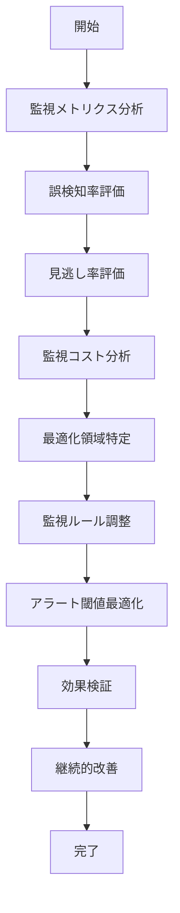

# UC-087: 監視最適化

## 概要

監視プロセス自体の効果性分析と最適化による監視品質の向上。

## アクター

- **プライマリ**: 監視システム管理者、DevOps エンジニア
- **セカンダリ**: システム（分析エンジン）、プロジェクトマネージャー

## 前提条件

- [ ] 監視データが十分蓄積済み
- [ ] 監視システムが安定稼働中
- [ ] 最適化目標が明確

## 事後条件

- [ ] 監視効率が向上済み
- [ ] アラート精度が改善済み
- [ ] 監視コストが最適化済み

## 基本フロー



## インターフェース定義

```typescript
interface MonitoringOptimization {
  optimizationId: string;
  monitoringScope: MonitoringScope;
  currentMetrics: MonitoringMetrics;
  optimizationTargets: OptimizationTarget[];
  adjustmentActions: AdjustmentAction[];
  effectMeasurement: EffectMeasurement;
  optimizationStatus: 'ANALYSIS' | 'ADJUSTMENT' | 'VERIFICATION' | 'COMPLETED';
}

interface MonitoringMetrics {
  falsePositiveRate: number; // percentage
  falseNegativeRate: number; // percentage
  meanTimeToDetection: number; // minutes
  meanTimeToResolution: number; // minutes
  monitoringCoverage: number; // percentage
  alertVolume: number; // alerts per day
  monitoringCost: number; // cost per day
}

interface OptimizationTarget {
  metric: 'FALSE_POSITIVE' | 'FALSE_NEGATIVE' | 'DETECTION_TIME' | 'COVERAGE' | 'COST';
  currentValue: number;
  targetValue: number;
  priority: 'HIGH' | 'MEDIUM' | 'LOW';
  timeline: number; // days
}
```

## 関連ページ

- **P-053**: 監視最適化ダッシュボード
- **P-054**: アラート精度分析ページ
- **P-055**: 監視コスト分析ページ

## メトリクス

- 誤検知率削減: 50%以上
- 見逃し率削減: 30%以上
- 検知時間短縮: 40%以上
- 監視コスト削減: 25%以上

## 更新履歴

| バージョン | 更新日 | 更新者 | 更新内容 |
|-----------|--------|---------|----------|
| 1.0 | 2024-11-05 | Claude Code | 初版作成 |