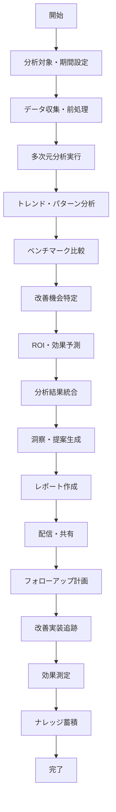
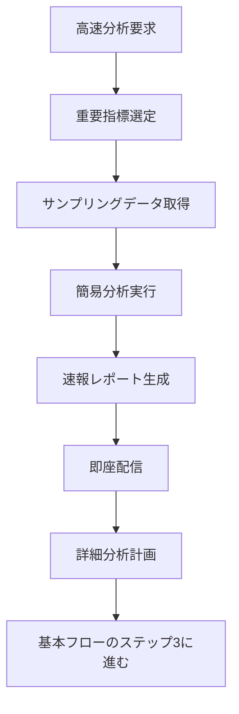
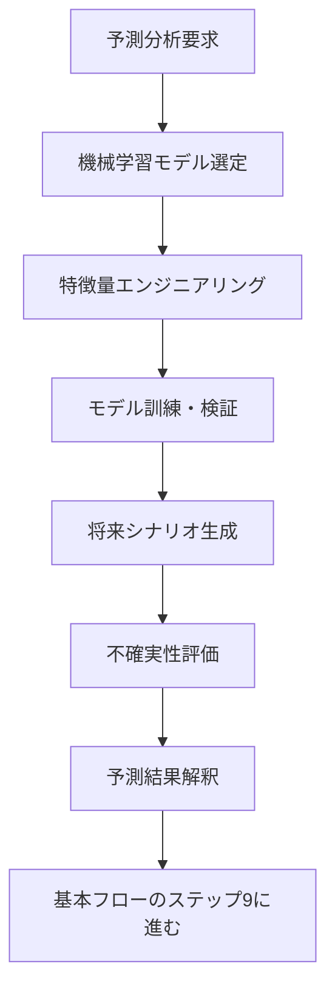
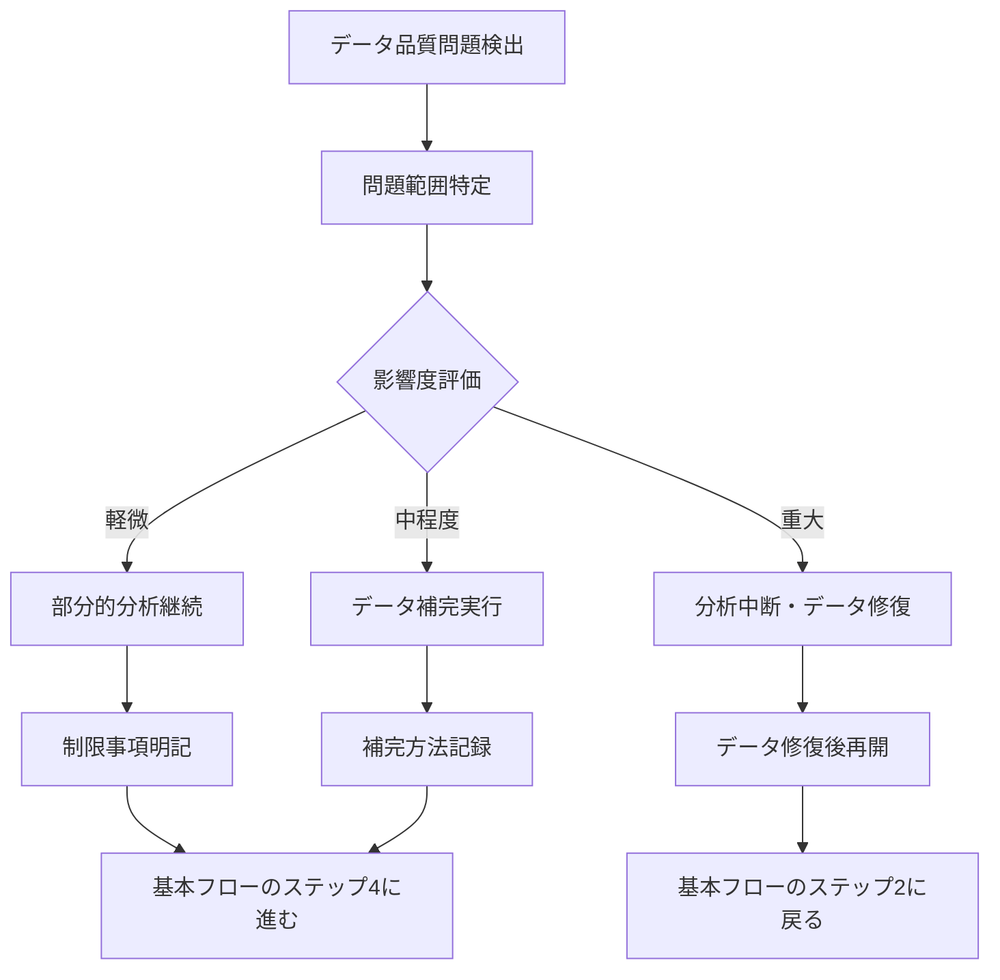
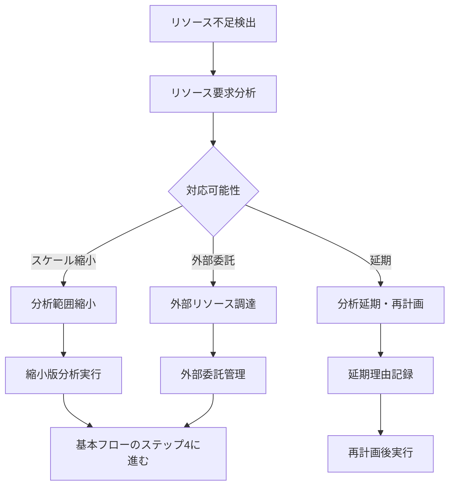

# Operation設計: op-008-analyze-performance

## Operation ID: op-008-analyze-performance

### 基本情報
- **Operation名**: パフォーマンス分析
- **所属Capability**: cap-003-task-monitoring タスク監視能力
- **所属BC**: BC-001 タスク管理
- **操作タイプ**: Query + Analytics（分析とレポート）
- **ビジネス価値**: 過去の実績データを分析し、継続的改善と将来予測の基盤を提供することで、組織の学習と成長を促進し長期的な競争優位性を構築する

### 概要
蓄積されたタスク実行データを多次元で分析し、パフォーマンス傾向、改善機会、将来予測を提供する操作。個人・チーム・プロジェクト・組織レベルでの洞察を生成し、データ駆動の意思決定と継続的改善文化の醸成を支援する。機械学習と統計分析を活用して、客観的で実行可能な改善提案を自動生成する。

### 操作の詳細

#### 目的
- 過去の実績データから有意義な洞察を抽出する
- パフォーマンス傾向と改善機会を特定する
- 将来のプロジェクト計画精度を向上させる
- 組織の学習と継続的改善を促進する
- データ駆動の戦略的意思決定を支援する

#### スコープ
- **含む**:
  - 多次元パフォーマンス分析（時間・品質・効率・コスト）
  - トレンド分析と将来予測
  - ベンチマーク比較（社内・業界標準）
  - 改善機会の特定と優先度付け
  - ROI分析と効果測定
- **含まない**:
  - リアルタイム監視（op-007で実施）
  - 個人の人事評価（HR評価プロセスとは分離）
  - プロジェクト実行の直接制御（PMの意思決定領域）

#### トリガー
- **スケジュールトリガー**: 定期的な分析実行（月次・四半期・年次）
- **イベントトリガー**: プロジェクト完了時の分析
- **手動トリガー**: 管理者による臨時分析要求

### ステークホルダー

#### プライマリアクター
- **ロール**: 経営層、PMO、データアナリスト、組織改善責任者
- **責任**:
  - 分析結果の適切な解釈と活用
  - 改善提案の評価と実行決定
  - 組織学習の促進と文化醸成
- **権限**: 分析データへのアクセス権（役割に応じた権限設定）

#### セカンダリアクター
- **プロジェクトマネージャー**: 分析結果の活用と改善実装
- **チームリーダー**: チーム改善の実行
- **外部コンサルタント**: 専門的分析支援

#### 受益者
- 組織全体（継続的改善とベストプラクティス共有）
- プロジェクトチーム（効率的な作業方法の習得）
- 経営層（戦略的意思決定の精度向上）
- 顧客（提供価値の向上）

### プロセスフロー

#### 基本フロー


1. **分析対象・期間設定**: 分析スコープと期間を設定
   - 入力: 分析要求、対象範囲、期間指定
   - 処理: 分析範囲の確定、必要データの特定
   - 出力: 確定された分析仕様

2. **データ収集・前処理**: 分析対象データを収集・整備
   - 入力: 分析仕様、データソース
   - 処理: データ抽出、クレンジング、正規化、統合
   - 出力: 分析可能な統合データセット

3. **多次元分析実行**: 様々な観点での分析を実行
   - 入力: 統合データセット、分析手法定義
   - 処理: 記述統計、相関分析、回帰分析、クラスタリング
   - 出力: 多次元分析結果

4. **トレンド・パターン分析**: 時系列トレンドとパターンを分析
   - 入力: 分析結果、時系列データ
   - 処理: トレンド検出、季節性分析、異常検知
   - 出力: トレンド分析レポート

5. **ベンチマーク比較**: 内外のベンチマークと比較
   - 入力: 分析結果、ベンチマークデータ
   - 処理: 同業界・同規模での位置付け分析
   - 出力: ベンチマーク比較結果

6. **改善機会特定**: 具体的な改善機会を特定
   - 入力: 分析結果、ベンチマーク、ベストプラクティス
   - 処理: ギャップ分析、機会損失計算、改善案生成
   - 出力: 優先度付き改善機会リスト

7. **ROI・効果予測**: 改善施策のROIを予測
   - 入力: 改善機会、コスト見積もり、効果予測モデル
   - 処理: 投資対効果計算、リスク評価
   - 出力: ROI予測と優先度ランキング

8. **分析結果統合**: 各分析結果を統合・整理
   - 入力: 各種分析結果、改善提案
   - 処理: 結果の統合、矛盾解決、重要度評価
   - 出力: 統合された分析結果

9. **洞察・提案生成**: 実行可能な洞察と提案を生成
   - 入力: 統合分析結果、組織コンテキスト
   - 処理: 戦略的含意の抽出、具体的アクション提案
   - 出力: 構造化された洞察と改善提案

10. **レポート作成**: ステークホルダー向けレポート作成
    - 入力: 洞察・提案、対象読者プロファイル
    - 処理: 可視化、要約、詳細説明の階層化
    - 出力: 多層レベルの分析レポート

11. **配信・共有**: 関係者にレポートを配信
    - 入力: 完成レポート、配信先リスト
    - 処理: 権限確認、個人向けカスタマイズ、配信
    - 出力: 配信完了確認

12. **フォローアップ計画**: 改善実装の計画策定
    - 入力: 改善提案、リソース制約、優先度
    - 処理: 実装計画作成、責任者指定、期限設定
    - 出力: 構造化された改善実装計画

13. **改善実装追跡**: 改善施策の実装状況追跡
    - 入力: 実装計画、進捗報告
    - 処理: 進捗監視、障害対応、計画調整
    - 出力: 実装進捗レポート

14. **効果測定**: 改善施策の効果を測定
    - 入力: 実装完了報告、ベースライン比較データ
    - 処理: before/after比較、効果量計算
    - 出力: 効果測定レポート

15. **ナレッジ蓄積**: 分析知見をナレッジベースに蓄積
    - 入力: 分析結果、改善効果、学習内容
    - 処理: 知見の抽象化、検索可能形式での保存
    - 出力: 更新されたナレッジベース

#### 代替フロー1: 高速分析モード（速報版）


- **分岐点**: 基本フロー ステップ1（分析対象・期間設定）
- **条件**: 緊急の意思決定支援が必要な場合

**代替手順**:
1. 最重要KPIに絞った高速分析を実行
2. サンプリングデータで迅速な洞察生成
3. 速報版レポートで暫定的な判断材料を提供
4. 後日、完全版分析で詳細確認

#### 代替フロー2: 予測重視分析（将来予測特化）


- **分岐点**: 基本フロー ステップ4（多次元分析実行）
- **条件**: 将来予測に特化した分析が要求された場合

**代替手順**:
1. 予測精度を重視したモデル設計
2. 特徴量の最適化と選択
3. 複数シナリオでの将来予測
4. 予測の不確実性と信頼区間の明示

#### 例外フロー1: データ品質問題


- **発生点**: ステップ2（データ収集・前処理）
- **条件**: 分析に必要なデータ品質が確保できない場合

**例外対応手順**:
1. データ欠損・不整合の範囲と影響を評価
2. 軽微な問題は制限事項として明記して継続
3. 重大な問題はデータ修復を優先
4. 分析結果の信頼性を適切に表示

#### 例外フロー2: 分析リソース不足


- **発生点**: ステップ3（多次元分析実行）
- **条件**: 計算リソースや専門人材が不足している場合

**例外対応手順**:
1. 必要リソースと利用可能リソースのギャップ分析
2. 分析範囲の優先度付けと段階的実行
3. 外部専門家の活用検討
4. 現実的なスケジュールでの再計画

### データ仕様

#### 入力データ
| 項目名 | 型 | 必須 | 説明 | 制約 |
|-------|----|----|------|------|
| analysisScope | object | ○ | 分析対象範囲 | プロジェクト・チーム・期間 |
| analysisType | enum | ○ | 分析種別 | Performance/Trend/Benchmark/Predictive |
| timePeriod | object | ○ | 分析期間 | 開始日・終了日 |
| comparisonBaseline | object | × | 比較基準 | 過去期間・他チーム等 |
| focusAreas | array | ○ | 重点分析領域 | 最大10領域 |
| outputFormat | enum | ○ | 出力形式 | Executive/Detailed/Technical |
| urgencyLevel | enum | × | 緊急度 | Low/Medium/High |
| stakeholderGroups | array | ○ | 対象ステークホルダー | 配信先グループ |

#### 出力データ
| 項目名 | 型 | 説明 | 備考 |
|-------|----|----|------|
| analysisId | uuid | 分析セッションID | システム自動生成 |
| executiveSummary | string | エグゼクティブサマリー | 重要な洞察の要約 |
| performanceMetrics | object | パフォーマンス指標 | 定量的評価結果 |
| trendAnalysis | object | トレンド分析結果 | 時系列変化パターン |
| benchmarkComparison | object | ベンチマーク比較 | 業界・社内基準との比較 |
| improvementOpportunities | array | 改善機会 | 優先度付きリスト |
| roiProjections | array | ROI予測 | 改善施策の投資効果 |
| recommendedActions | array | 推奨アクション | 具体的な改善提案 |
| confidenceScores | object | 信頼度スコア | 分析結果の信頼性 |

#### 内部データ
| 項目名 | 型 | 説明 | ライフサイクル |
|-------|----|----|------------|
| analysisHistory | array | 分析履歴 | 永続保存 |
| modelPerformance | object | 予測モデル性能 | モデル改善用 |
| analysisMethodology | object | 分析手法記録 | 再現性確保用 |

### ビジネスルール

#### 必須ルール
1. **客観性**: 分析は客観的データに基づき、主観的偏見を排除
2. **透明性**: 分析手法と前提条件を明確に文書化
3. **実行可能性**: 提案は組織の実行能力を考慮した現実的内容
4. **継続性**: 分析結果は継続的改善サイクルに組み込み

#### 制約条件
1. **データプライバシー**: 個人識別可能情報の適切な匿名化
2. **分析頻度**: 大規模分析は月次以下の頻度に制限
3. **リソース制限**: 分析処理は業務時間外に実行

#### バリデーション
1. **データ品質**: 分析対象データの完全性・正確性確認
2. **統計的有意性**: 統計的に有意な結果のみを結論として採用
3. **実装可能性**: 提案の技術的・経済的実現可能性確認

### 品質要求

#### パフォーマンス
- **分析処理時間**: 通常分析は4時間以内で完了
- **大規模分析**: 最大24時間以内での処理完了
- **レポート生成**: 分析完了から30分以内でレポート配信

#### 可用性
- **稼働率**: 99.5%（分析機能の高可用性）
- **データ保持**: 分析結果は5年間保持

#### セキュリティ
- **認証要求**: 多要素認証による厳格なアクセス制御
- **認可要求**: 役割ベースの分析データアクセス制御
- **データ保護**: 分析データの暗号化と機密性保持

### UseCase関連

#### 関連UseCase
| UseCase ID | UseCase名 | 関係 | 説明 |
|-----------|----------|------|------|
| uc-008-performance-analysis | パフォーマンス分析 | implements | このOperationが直接実現するUseCase |

#### 実現するUseCase
- **uc-008-performance-analysis**: パフォーマンス分析 - 継続的改善のためのデータ分析

### 実装指針

#### 技術要求
- **使用技術**: TypeScript, Next.js Server Actions, Prisma ORM
- **フレームワーク**: D3.js（データ可視化）, Apache Spark（大規模データ処理）
- **ライブラリ**: TensorFlow.js（機械学習）, Chart.js（グラフ生成）

#### アーキテクチャ
- **パターン**: ETL Pipeline + Data Lake + Analytics Engine
- **層構造**: Data Collection → Processing → Analytics → Presentation

#### 実装の考慮事項
1. **スケーラブル処理**: 大量データに対応した分散処理
2. **機械学習**: 予測精度向上のための継続学習
3. **可視化**: 直感的で理解しやすいダッシュボード

### テスト設計

#### テストシナリオ
1. **正常系テスト**:
   - 通常の月次分析処理
   - 大規模データでの年次分析
   - 予測分析の精度検証

2. **異常系テスト**:
   - データ品質問題での処理
   - リソース不足時の動作
   - 不正データでの分析

3. **境界値テスト**:
   - 最大データ量での処理
   - 最小データでの分析
   - 極端な値での統計処理

#### テストデータ
- **正常データセット**: 様々な規模・期間のプロジェクトデータ
- **異常データセット**: 欠損・異常値を含むデータ
- **境界値データセット**: 極値データでの動作確認

### メトリクス

#### ビジネスメトリクス
- **改善実装率**: 提案された改善の実装率（目標: 70%以上）
- **改善効果**: 実装した改善の実際の効果（目標: 予測の80%以上）
- **意思決定支援**: 分析結果が意思決定に活用された割合（目標: 90%以上）
- **ROI実現**: 予測ROIの実現率（目標: 予測値の80%以上）

#### 技術メトリクス
- **分析精度**: 予測分析の的中率（目標: 85%以上）
- **処理性能**: 分析処理時間（目標: 目標時間の90%以内）
- **データ品質**: 分析データの完全性（目標: 95%以上）

### 依存関係

#### 前提条件
- 過去のタスク実行データが十分に蓄積されていること
- 分析に必要な外部ベンチマークデータが整備されていること
- 組織の改善実装能力とリソースが確保されていること

#### 他のOperationとの関係
- **データ源**: op-001〜op-007の全Operation（包括的なデータ活用）
- **改善対象**: 分析結果は全Operationの改善に活用

### リスクと対策

#### 特定されたリスク
1. **分析麻痺**: 過度な分析による意思決定の遅延
   - 対策: 実行可能な分析範囲の設定と期限の厳守

2. **データ偏見**: 不完全なデータによる誤った結論
   - 対策: データ品質の継続的監視と多角的検証

3. **改善疲れ**: 継続的な改善要求による組織の疲弊
   - 対策: 改善の優先度付けと段階的実装

### 更新履歴
- 2025-11-05: 初版作成（Issue #199対応、MVP版Phase 2.2） - Claude

---

## 分析エンジン設計

### 多次元分析フレームワーク
```typescript
interface PerformanceAnalysis {
  temporal: {                    // 時間軸分析
    trends: TrendAnalysis[];
    seasonality: SeasonalPattern[];
    forecasts: Forecast[];
  };

  efficiency: {                  // 効率性分析
    productivity: ProductivityMetrics;
    resourceUtilization: ResourceMetrics;
    processEfficiency: ProcessMetrics;
  };

  quality: {                     // 品質分析
    defectRates: QualityMetrics;
    reviewEffectiveness: ReviewMetrics;
    customerSatisfaction: SatisfactionMetrics;
  };

  collaboration: {               // 協力効果分析
    knowledgeSharing: SharingMetrics;
    teamDynamics: TeamMetrics;
    crossFunctionalEfficiency: CollaborationMetrics;
  };
}
```

### ROI予測モデル
```typescript
interface ROIProjection {
  improvement: string;           // 改善内容
  implementation: {
    cost: number;               // 実装コスト
    timeframe: number;          // 実装期間（月）
    resources: ResourceRequirement[];
  };

  benefits: {
    productivityGain: number;   // 生産性向上 (%)
    qualityImprovement: number; // 品質向上 (%)
    costReduction: number;      // コスト削減額
    timeToMarket: number;       // 市場投入時間短縮 (%)
  };

  roi: {
    breakEvenPeriod: number;    // 投資回収期間（月）
    netPresentValue: number;    // 正味現在価値
    internalRateOfReturn: number; // 内部収益率
    confidenceInterval: [number, number]; // 信頼区間
  };
}
```

## 継続的改善サイクル

### PDCA統合
1. **Plan**: 分析結果に基づく改善計画
2. **Do**: 改善施策の段階的実装
3. **Check**: 効果測定と予測精度検証
4. **Act**: 学習内容の標準化と次期計画への反映

この設計により、データ駆動の継続的改善エコシステムが完成します。

## 🎉 BC-001 タスク管理 完全設計完了！

**全8つのOperationsが完成**し、エンジニアが直接実装できるレベルの詳細設計が完了しました。