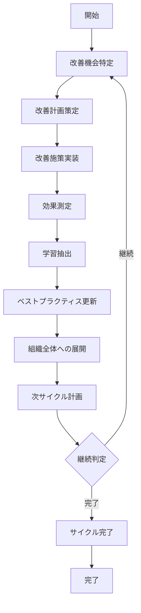
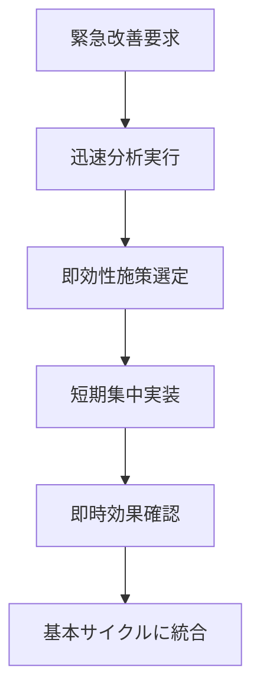
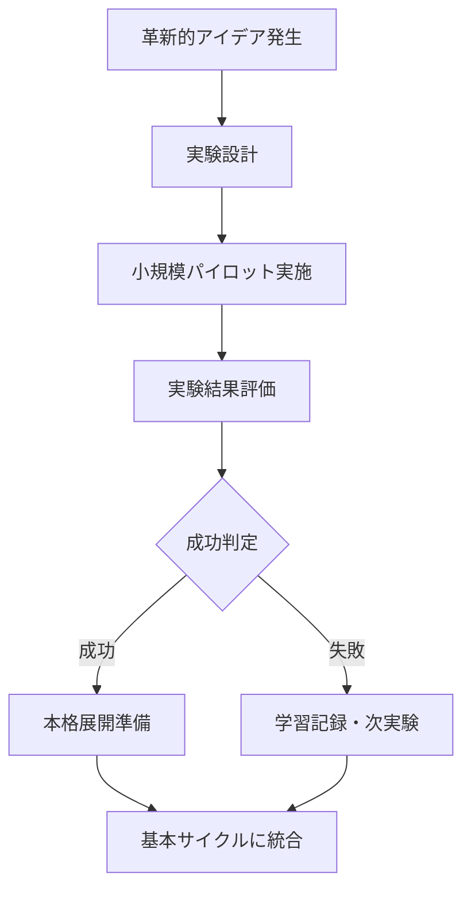
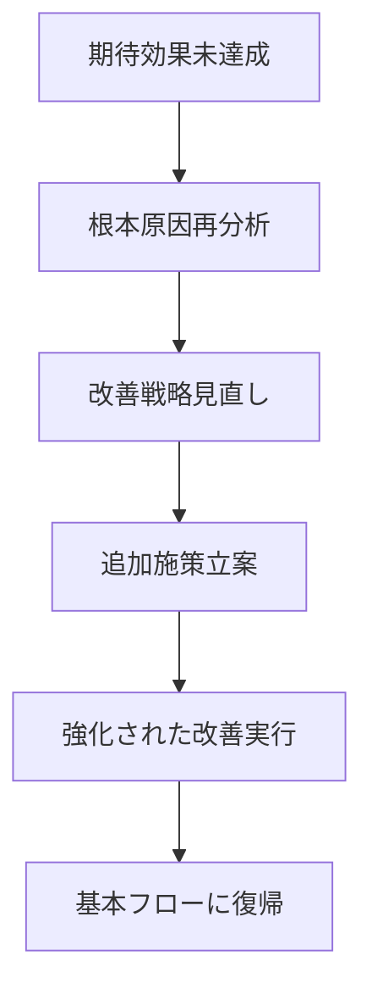

# UC-099: 継続的改善サイクル

## 概要

パフォーマンス分析結果を基盤とした組織全体の継続的改善サイクルの確立と運用。

## アクター

- **プライマリ**: プロセス改善チーム、組織変革リーダー
- **セカンダリ**: システム（学習エンジン）、全チームメンバー

## 前提条件

- [ ] パフォーマンス分析が完了済み
- [ ] 改善推奨事項が特定済み
- [ ] 改善サイクルの承認が取得済み

## 事後条件

- [ ] 改善サイクルが確立済み
- [ ] 組織学習が促進済み
- [ ] 継続的な価値向上が実現済み

## 基本フロー



### ステップ詳細

1. **改善機会特定**: パフォーマンス分析結果から具体的な改善機会を特定
2. **改善計画策定**: 優先順位付けされた改善アクションプランを作成
3. **改善施策実装**: 計画された改善施策を段階的に実装
4. **効果測定**: 改善施策の効果を定量的・定性的に測定
5. **学習抽出**: 成功・失敗要因から組織学習を抽出
6. **ベストプラクティス更新**: 学習内容を組織のベストプラクティスに反映
7. **組織展開**: 効果的な改善策を組織全体に水平展開
8. **次サイクル計画**: 学習結果を踏まえた次の改善サイクルを計画

## 代替フロー1: 急速改善モード



**条件**: 急速な改善が必要な重要課題が発生した場合

## 代替フロー2: 実験的改善



**条件**: 革新的だが効果が不確実な改善アイデアを検証する場合

## 例外フロー1: 改善効果不足



## ビジネスルール

### BR-001: 改善サイクル頻度
- 通常サイクル: 四半期毎の定期実行
- 急速サイクル: 必要に応じて月次実行
- 継続監視: 週次での進捗確認

### BR-002: 改善効果測定基準
- 定量指標: 効率性20%向上、品質15%向上、満足度4.5/5.0以上
- 定性指標: チーム学習度、イノベーション創出度
- ROI基準: 投資対効果3:1以上

### BR-003: 組織学習基準
- 成功事例: 再現可能性80%以上でベストプラクティス化
- 失敗事例: 教訓として文書化・共有必須
- 知識移転: 3ヶ月以内に関連チーム全体に展開

## 非機能要件

### 継続性
- 改善サイクルの中断リスク最小化
- リーダーシップ変更への対応
- 組織文化への定着促進

### 測定可能性
- 全改善施策の効果測定可能化
- 学習成果の定量化
- 長期トレンドの可視化

### 拡張性
- 組織規模拡大への対応
- 新しい改善手法の統合
- 外部ベストプラクティスの取り込み

## テストケース

### TC-001: 正常系 - 標準改善サイクル
1. パフォーマンス分析で「レビュー効率20%低下」を特定
2. 改善計画「レビュープロセス標準化」を策定
3. 2週間でプロセス標準化を実装
4. 1ヶ月後の効果測定で25%改善を確認
5. 成功要因を抽出しベストプラクティス更新
6. 他チームへの水平展開実行
7. 次四半期の改善サイクル計画策定

### TC-002: 代替系 - 急速改善モード
1. 重要顧客からの品質クレーム発生
2. 緊急分析で品質チェック漏れを特定
3. 即効性のある「ダブルチェック制度」を選定
4. 1週間で全チームに展開実装
5. 2週間後に品質問題解消を確認
6. 標準改善サイクルに統合

### TC-003: 例外系 - 改善効果不足
1. 協働効率改善施策を実装
2. 期待された30%改善に対し10%のみ達成
3. 根本原因分析で「ツール習熟不足」を発見
4. 追加施策「集中トレーニングプログラム」を立案
5. 強化施策実行で目標25%改善を達成
6. 改善プロセスの学習として記録

## 関連ページ

- **P-056**: 継続的改善ダッシュボード
- **P-057**: 改善サイクル管理ページ
- **P-058**: 組織学習記録ページ
- **P-059**: 効果測定結果表示ページ

## インターフェース定義

### ContinuousImprovementCycle
```typescript
interface ContinuousImprovementCycle {
  cycleId: string;
  cycleType: 'REGULAR' | 'RAPID' | 'EXPERIMENTAL';
  improvementOpportunities: ImprovementOpportunity[];
  improvementPlan: ImprovementPlan;
  implementationResults: ImplementationResult[];
  effectMeasurement: EffectMeasurement;
  organizationalLearning: OrganizationalLearning;
  nextCyclePlan: NextCyclePlan;
  cycleStatus: 'PLANNING' | 'IMPLEMENTING' | 'MEASURING' | 'LEARNING' | 'COMPLETED';
}

interface ImprovementOpportunity {
  opportunityId: string;
  area: 'EFFICIENCY' | 'QUALITY' | 'COLLABORATION' | 'INNOVATION';
  currentState: string;
  targetState: string;
  potentialImpact: 'HIGH' | 'MEDIUM' | 'LOW';
  implementationEffort: 'HIGH' | 'MEDIUM' | 'LOW';
  priority: number; // 1-10
}

interface OrganizationalLearning {
  successFactors: string[];
  failureFactors: string[];
  lessonsLearned: string[];
  bestPracticesUpdated: string[];
  knowledgeTransferPlan: KnowledgeTransferPlan;
}
```

### EffectMeasurement
```typescript
interface EffectMeasurement {
  measurementId: string;
  quantitativeMetrics: QuantitativeMetric[];
  qualitativeMetrics: QualitativeMetric[];
  roiCalculation: ROICalculation;
  customerSatisfactionImpact: number; // 0.0-5.0
  teamSatisfactionImpact: number; // 0.0-5.0
  sustainabilityScore: number; // 0-100
}

interface QuantitativeMetric {
  metricName: string;
  beforeValue: number;
  afterValue: number;
  improvementPercentage: number;
  targetValue: number;
  achievementRate: number; // 0.0-1.0
}
```

## メトリクス

- 改善サイクル実行成功率: 90%以上
- 改善効果達成率: 80%以上（目標値に対する）
- 組織学習定着率: 85%以上
- 改善施策持続率: 70%以上（6ヶ月後）
- 全社的改善文化浸透度: 4.0/5.0以上

## 更新履歴

| バージョン | 更新日 | 更新者 | 更新内容 |
|-----------|--------|---------|----------|
| 1.0 | 2024-11-05 | Claude Code | 初版作成 |