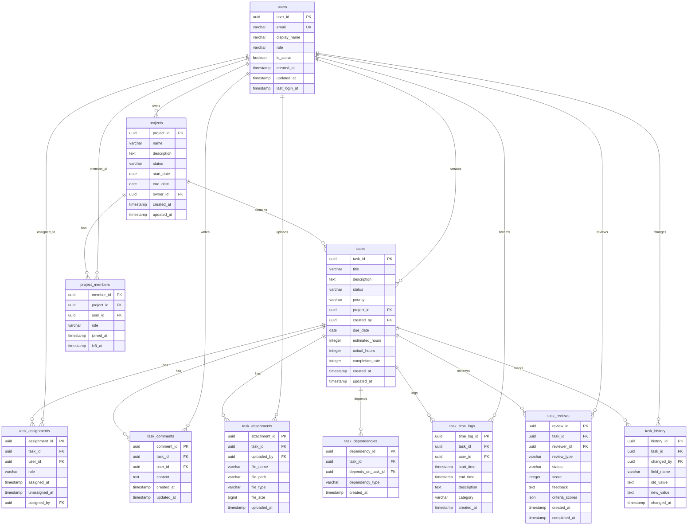

# パラソルV3 MVP データベース設計書

## 概要

パラソルV3 MVP（タスク管理境界コンテキスト）のデータベース設計書。論理設計、物理設計、パフォーマンス考慮事項を含む。

## バージョン情報

| 項目 | 内容 |
|------|------|
| バージョン | 1.0 |
| 作成日 | 2024-11-05 |
| 作成者 | Claude Code |
| 対象システム | パラソルV3 MVP - BC-001タスク管理 |
| データベース | PostgreSQL 15+ |

---

## 1. データベース設計原則

### 1.1 設計方針
- **正規化**: 第3正規形を基本とし、パフォーマンス要件に応じて非正規化
- **スケーラビリティ**: 水平・垂直スケーリングを考慮
- **パフォーマンス**: 適切なインデックス設計と分割戦略
- **データ整合性**: 外部キー制約とチェック制約による整合性保証

### 1.2 命名規則
- **テーブル名**: スネークケース、複数形（例: `tasks`, `user_assignments`）
- **カラム名**: スネークケース（例: `created_at`, `task_id`）
- **インデックス名**: `idx_{table}_{column}` 形式
- **制約名**: `{type}_{table}_{column}` 形式

---

## 2. ER図



---

## 3. テーブル設計詳細

### 3.1 users（ユーザー）

**用途**: システム利用者情報の管理

| カラム名 | データ型 | 制約 | 説明 |
|----------|----------|------|------|
| user_id | UUID | PK | ユーザー識別子 |
| email | VARCHAR(255) | NOT NULL, UNIQUE | メールアドレス |
| display_name | VARCHAR(100) | NOT NULL | 表示名 |
| role | VARCHAR(20) | NOT NULL | ロール（ADMIN, MANAGER, MEMBER, VIEWER） |
| is_active | BOOLEAN | NOT NULL DEFAULT true | アクティブ状態 |
| created_at | TIMESTAMP | NOT NULL DEFAULT NOW() | 作成日時 |
| updated_at | TIMESTAMP | NOT NULL DEFAULT NOW() | 更新日時 |
| last_login_at | TIMESTAMP | NULL | 最終ログイン日時 |

**制約**:
```sql
ALTER TABLE users ADD CONSTRAINT chk_users_role
CHECK (role IN ('ADMIN', 'MANAGER', 'MEMBER', 'VIEWER'));

ALTER TABLE users ADD CONSTRAINT chk_users_email_format
CHECK (email ~* '^[A-Za-z0-9._%+-]+@[A-Za-z0-9.-]+\.[A-Za-z]{2,}$');
```

### 3.2 projects（プロジェクト）

**用途**: プロジェクト情報の管理

| カラム名 | データ型 | 制約 | 説明 |
|----------|----------|------|------|
| project_id | UUID | PK | プロジェクト識別子 |
| name | VARCHAR(200) | NOT NULL | プロジェクト名 |
| description | TEXT | NULL | プロジェクト説明 |
| status | VARCHAR(20) | NOT NULL | ステータス |
| start_date | DATE | NULL | 開始日 |
| end_date | DATE | NULL | 終了日 |
| owner_id | UUID | NOT NULL, FK | オーナーユーザーID |
| created_at | TIMESTAMP | NOT NULL DEFAULT NOW() | 作成日時 |
| updated_at | TIMESTAMP | NOT NULL DEFAULT NOW() | 更新日時 |

**制約**:
```sql
ALTER TABLE projects ADD CONSTRAINT chk_projects_status
CHECK (status IN ('PLANNING', 'ACTIVE', 'ON_HOLD', 'COMPLETED', 'CANCELLED'));

ALTER TABLE projects ADD CONSTRAINT chk_projects_dates
CHECK (start_date IS NULL OR end_date IS NULL OR start_date <= end_date);

ALTER TABLE projects ADD CONSTRAINT fk_projects_owner
FOREIGN KEY (owner_id) REFERENCES users(user_id);
```

### 3.3 tasks（タスク）

**用途**: タスク情報の管理

| カラム名 | データ型 | 制約 | 説明 |
|----------|----------|------|------|
| task_id | UUID | PK | タスク識別子 |
| title | VARCHAR(200) | NOT NULL | タスク名 |
| description | TEXT | NULL | タスク説明 |
| status | VARCHAR(20) | NOT NULL DEFAULT 'TODO' | ステータス |
| priority | VARCHAR(20) | NOT NULL DEFAULT 'MEDIUM' | 優先度 |
| project_id | UUID | NOT NULL, FK | プロジェクトID |
| created_by | UUID | NOT NULL, FK | 作成者ユーザーID |
| due_date | DATE | NULL | 期限日 |
| estimated_hours | INTEGER | NULL CHECK (estimated_hours > 0) | 見積時間 |
| actual_hours | INTEGER | NULL CHECK (actual_hours >= 0) | 実績時間 |
| completion_rate | INTEGER | NOT NULL DEFAULT 0 CHECK (completion_rate >= 0 AND completion_rate <= 100) | 完了率 |
| created_at | TIMESTAMP | NOT NULL DEFAULT NOW() | 作成日時 |
| updated_at | TIMESTAMP | NOT NULL DEFAULT NOW() | 更新日時 |

**制約**:
```sql
ALTER TABLE tasks ADD CONSTRAINT chk_tasks_status
CHECK (status IN ('TODO', 'IN_PROGRESS', 'REVIEW', 'DONE', 'CANCELLED'));

ALTER TABLE tasks ADD CONSTRAINT chk_tasks_priority
CHECK (priority IN ('CRITICAL', 'HIGH', 'MEDIUM', 'LOW'));

ALTER TABLE tasks ADD CONSTRAINT fk_tasks_project
FOREIGN KEY (project_id) REFERENCES projects(project_id);

ALTER TABLE tasks ADD CONSTRAINT fk_tasks_created_by
FOREIGN KEY (created_by) REFERENCES users(user_id);
```

### 3.4 task_assignments（タスクアサイン）

**用途**: タスクとユーザーのアサイン関係管理

| カラム名 | データ型 | 制約 | 説明 |
|----------|----------|------|------|
| assignment_id | UUID | PK | アサイン識別子 |
| task_id | UUID | NOT NULL, FK | タスクID |
| user_id | UUID | NOT NULL, FK | ユーザーID |
| role | VARCHAR(20) | NOT NULL | アサインロール |
| assigned_at | TIMESTAMP | NOT NULL DEFAULT NOW() | アサイン日時 |
| unassigned_at | TIMESTAMP | NULL | アサイン解除日時 |
| assigned_by | UUID | NOT NULL, FK | アサイン実行者ID |

**制約**:
```sql
ALTER TABLE task_assignments ADD CONSTRAINT chk_assignment_role
CHECK (role IN ('ASSIGNEE', 'REVIEWER', 'OBSERVER'));

ALTER TABLE task_assignments ADD CONSTRAINT uk_task_user_active
UNIQUE (task_id, user_id) WHERE unassigned_at IS NULL;

ALTER TABLE task_assignments ADD CONSTRAINT fk_assignment_task
FOREIGN KEY (task_id) REFERENCES tasks(task_id);

ALTER TABLE task_assignments ADD CONSTRAINT fk_assignment_user
FOREIGN KEY (user_id) REFERENCES users(user_id);

ALTER TABLE task_assignments ADD CONSTRAINT fk_assignment_assigned_by
FOREIGN KEY (assigned_by) REFERENCES users(user_id);
```

### 3.5 task_time_logs（時間記録）

**用途**: タスクの作業時間記録

| カラム名 | データ型 | 制約 | 説明 |
|----------|----------|------|------|
| time_log_id | UUID | PK | 時間記録識別子 |
| task_id | UUID | NOT NULL, FK | タスクID |
| user_id | UUID | NOT NULL, FK | ユーザーID |
| start_time | TIMESTAMP | NOT NULL | 開始時刻 |
| end_time | TIMESTAMP | NOT NULL | 終了時刻 |
| description | TEXT | NULL | 作業内容説明 |
| category | VARCHAR(50) | NULL | 作業カテゴリ |
| created_at | TIMESTAMP | NOT NULL DEFAULT NOW() | 作成日時 |

**制約**:
```sql
ALTER TABLE task_time_logs ADD CONSTRAINT chk_time_range
CHECK (start_time < end_time);

ALTER TABLE task_time_logs ADD CONSTRAINT chk_time_category
CHECK (category IN ('DEVELOPMENT', 'TESTING', 'REVIEW', 'MEETING', 'RESEARCH', 'OTHER'));

ALTER TABLE task_time_logs ADD CONSTRAINT fk_time_logs_task
FOREIGN KEY (task_id) REFERENCES tasks(task_id);

ALTER TABLE task_time_logs ADD CONSTRAINT fk_time_logs_user
FOREIGN KEY (user_id) REFERENCES users(user_id);
```

---

## 4. インデックス設計

### 4.1 主要インデックス

```sql
-- パフォーマンス重要インデックス
CREATE INDEX idx_tasks_project_status ON tasks(project_id, status);
CREATE INDEX idx_tasks_assigned_user ON task_assignments(user_id) WHERE unassigned_at IS NULL;
CREATE INDEX idx_tasks_due_date ON tasks(due_date) WHERE due_date IS NOT NULL;
CREATE INDEX idx_task_history_task_time ON task_history(task_id, changed_at);

-- 検索・フィルタリング用インデックス
CREATE INDEX idx_tasks_priority_status ON tasks(priority, status);
CREATE INDEX idx_tasks_created_at ON tasks(created_at);
CREATE INDEX idx_projects_owner_status ON projects(owner_id, status);

-- 複合インデックス（よく使われるクエリパターン用）
CREATE INDEX idx_tasks_project_priority_status ON tasks(project_id, priority, status);
CREATE INDEX idx_time_logs_task_user_time ON task_time_logs(task_id, user_id, start_time);
```

### 4.2 パーシャルインデックス

```sql
-- アクティブなタスクのみ
CREATE INDEX idx_tasks_active ON tasks(project_id, priority)
WHERE status IN ('TODO', 'IN_PROGRESS', 'REVIEW');

-- アクティブなアサインメントのみ
CREATE INDEX idx_assignments_active ON task_assignments(user_id, task_id)
WHERE unassigned_at IS NULL;

-- 期限近づくタスク
CREATE INDEX idx_tasks_upcoming_deadline ON tasks(due_date, status)
WHERE due_date >= CURRENT_DATE AND due_date <= CURRENT_DATE + INTERVAL '7 days';
```

---

## 5. パーティショニング戦略

### 5.1 時系列パーティショニング

```sql
-- タスク履歴の月次パーティショニング
CREATE TABLE task_history (
    history_id UUID DEFAULT gen_random_uuid(),
    task_id UUID NOT NULL,
    changed_by UUID NOT NULL,
    field_name VARCHAR(50) NOT NULL,
    old_value TEXT,
    new_value TEXT,
    changed_at TIMESTAMP NOT NULL DEFAULT NOW()
) PARTITION BY RANGE (changed_at);

-- パーティション作成例（月次）
CREATE TABLE task_history_2024_11 PARTITION OF task_history
FOR VALUES FROM ('2024-11-01') TO ('2024-12-01');

CREATE TABLE task_history_2024_12 PARTITION OF task_history
FOR VALUES FROM ('2024-12-01') TO ('2025-01-01');
```

### 5.2 時間記録の年次パーティショニング

```sql
-- 時間記録の年次パーティショニング
ALTER TABLE task_time_logs PARTITION BY RANGE (EXTRACT(YEAR FROM start_time));

CREATE TABLE task_time_logs_2024 PARTITION OF task_time_logs
FOR VALUES FROM (2024) TO (2025);

CREATE TABLE task_time_logs_2025 PARTITION OF task_time_logs
FOR VALUES FROM (2025) TO (2026);
```

---

## 6. ビュー定義

### 6.1 タスク概要ビュー

```sql
CREATE VIEW v_task_summary AS
SELECT
    t.task_id,
    t.title,
    t.status,
    t.priority,
    t.completion_rate,
    t.due_date,
    p.name AS project_name,
    u.display_name AS created_by_name,
    COUNT(ta.user_id) AS assigned_user_count,
    COALESCE(SUM(ttl.end_time - ttl.start_time), INTERVAL '0') AS total_time_spent
FROM tasks t
LEFT JOIN projects p ON t.project_id = p.project_id
LEFT JOIN users u ON t.created_by = u.user_id
LEFT JOIN task_assignments ta ON t.task_id = ta.task_id AND ta.unassigned_at IS NULL
LEFT JOIN task_time_logs ttl ON t.task_id = ttl.task_id
GROUP BY t.task_id, t.title, t.status, t.priority, t.completion_rate,
         t.due_date, p.name, u.display_name;
```

### 6.2 ユーザー作業負荷ビュー

```sql
CREATE VIEW v_user_workload AS
SELECT
    u.user_id,
    u.display_name,
    COUNT(ta.task_id) AS assigned_task_count,
    COUNT(CASE WHEN t.status IN ('TODO', 'IN_PROGRESS') THEN 1 END) AS active_task_count,
    COALESCE(SUM(t.estimated_hours), 0) AS total_estimated_hours,
    COALESCE(AVG(t.completion_rate), 0) AS avg_completion_rate
FROM users u
LEFT JOIN task_assignments ta ON u.user_id = ta.user_id AND ta.unassigned_at IS NULL
LEFT JOIN tasks t ON ta.task_id = t.task_id
WHERE u.is_active = true
GROUP BY u.user_id, u.display_name;
```

### 6.3 プロジェクト進捗ビュー

```sql
CREATE VIEW v_project_progress AS
SELECT
    p.project_id,
    p.name,
    p.status,
    COUNT(t.task_id) AS total_tasks,
    COUNT(CASE WHEN t.status = 'DONE' THEN 1 END) AS completed_tasks,
    COUNT(CASE WHEN t.status IN ('TODO', 'IN_PROGRESS', 'REVIEW') THEN 1 END) AS active_tasks,
    ROUND(
        CASE
            WHEN COUNT(t.task_id) > 0
            THEN (COUNT(CASE WHEN t.status = 'DONE' THEN 1 END) * 100.0 / COUNT(t.task_id))
            ELSE 0
        END, 2
    ) AS completion_percentage
FROM projects p
LEFT JOIN tasks t ON p.project_id = t.project_id
GROUP BY p.project_id, p.name, p.status;
```

---

## 7. ストアドプロシージャ

### 7.1 タスクステータス更新

```sql
CREATE OR REPLACE FUNCTION update_task_status(
    p_task_id UUID,
    p_new_status VARCHAR(20),
    p_user_id UUID
) RETURNS BOOLEAN AS $$
DECLARE
    v_old_status VARCHAR(20);
    v_valid_transition BOOLEAN := FALSE;
BEGIN
    -- 現在のステータス取得
    SELECT status INTO v_old_status FROM tasks WHERE task_id = p_task_id;

    IF NOT FOUND THEN
        RAISE EXCEPTION 'Task not found: %', p_task_id;
    END IF;

    -- ステータス遷移妥当性チェック
    v_valid_transition := CASE
        WHEN v_old_status = 'TODO' AND p_new_status = 'IN_PROGRESS' THEN TRUE
        WHEN v_old_status = 'IN_PROGRESS' AND p_new_status IN ('REVIEW', 'DONE') THEN TRUE
        WHEN v_old_status = 'REVIEW' AND p_new_status IN ('IN_PROGRESS', 'DONE') THEN TRUE
        WHEN p_new_status = 'CANCELLED' THEN TRUE
        ELSE FALSE
    END;

    IF NOT v_valid_transition THEN
        RAISE EXCEPTION 'Invalid status transition from % to %', v_old_status, p_new_status;
    END IF;

    -- ステータス更新
    UPDATE tasks
    SET status = p_new_status, updated_at = NOW()
    WHERE task_id = p_task_id;

    -- 履歴記録
    INSERT INTO task_history (task_id, changed_by, field_name, old_value, new_value)
    VALUES (p_task_id, p_user_id, 'status', v_old_status, p_new_status);

    RETURN TRUE;
END;
$$ LANGUAGE plpgsql;
```

### 7.2 プロジェクト進捗計算

```sql
CREATE OR REPLACE FUNCTION calculate_project_progress(p_project_id UUID)
RETURNS TABLE(
    total_tasks INTEGER,
    completed_tasks INTEGER,
    completion_percentage NUMERIC
) AS $$
BEGIN
    RETURN QUERY
    SELECT
        COUNT(*)::INTEGER AS total_tasks,
        COUNT(CASE WHEN status = 'DONE' THEN 1 END)::INTEGER AS completed_tasks,
        ROUND(
            CASE
                WHEN COUNT(*) > 0
                THEN (COUNT(CASE WHEN status = 'DONE' THEN 1 END) * 100.0 / COUNT(*))
                ELSE 0
            END, 2
        ) AS completion_percentage
    FROM tasks
    WHERE project_id = p_project_id;
END;
$$ LANGUAGE plpgsql;
```

---

## 8. トリガー

### 8.1 更新日時自動更新

```sql
-- 共通の更新日時更新関数
CREATE OR REPLACE FUNCTION update_updated_at_column()
RETURNS TRIGGER AS $$
BEGIN
    NEW.updated_at = NOW();
    RETURN NEW;
END;
$$ LANGUAGE plpgsql;

-- 各テーブルに適用
CREATE TRIGGER tr_users_updated_at
    BEFORE UPDATE ON users
    FOR EACH ROW EXECUTE FUNCTION update_updated_at_column();

CREATE TRIGGER tr_projects_updated_at
    BEFORE UPDATE ON projects
    FOR EACH ROW EXECUTE FUNCTION update_updated_at_column();

CREATE TRIGGER tr_tasks_updated_at
    BEFORE UPDATE ON tasks
    FOR EACH ROW EXECUTE FUNCTION update_updated_at_column();
```

### 8.2 タスク変更履歴記録

```sql
CREATE OR REPLACE FUNCTION record_task_changes()
RETURNS TRIGGER AS $$
BEGIN
    -- ステータス変更
    IF OLD.status != NEW.status THEN
        INSERT INTO task_history (task_id, changed_by, field_name, old_value, new_value)
        VALUES (NEW.task_id, NEW.updated_by, 'status', OLD.status, NEW.status);
    END IF;

    -- 完了率変更
    IF OLD.completion_rate != NEW.completion_rate THEN
        INSERT INTO task_history (task_id, changed_by, field_name, old_value, new_value)
        VALUES (NEW.task_id, NEW.updated_by, 'completion_rate',
                OLD.completion_rate::TEXT, NEW.completion_rate::TEXT);
    END IF;

    RETURN NEW;
END;
$$ LANGUAGE plpgsql;

CREATE TRIGGER tr_task_changes
    AFTER UPDATE ON tasks
    FOR EACH ROW EXECUTE FUNCTION record_task_changes();
```

---

## 9. パフォーマンス最適化

### 9.1 クエリ最適化

```sql
-- よく使われるクエリパターンの最適化例

-- 1. ユーザーのアクティブタスク一覧
EXPLAIN (ANALYZE, BUFFERS)
SELECT t.task_id, t.title, t.status, t.priority, t.due_date
FROM tasks t
INNER JOIN task_assignments ta ON t.task_id = ta.task_id
WHERE ta.user_id = $1
  AND ta.unassigned_at IS NULL
  AND t.status IN ('TODO', 'IN_PROGRESS', 'REVIEW')
ORDER BY t.priority, t.due_date NULLS LAST;

-- 2. プロジェクトダッシュボード用データ
EXPLAIN (ANALYZE, BUFFERS)
SELECT
    p.project_id,
    p.name,
    COUNT(t.task_id) AS total_tasks,
    COUNT(CASE WHEN t.status = 'DONE' THEN 1 END) AS completed_tasks
FROM projects p
LEFT JOIN tasks t ON p.project_id = t.project_id
WHERE p.status = 'ACTIVE'
GROUP BY p.project_id, p.name
ORDER BY p.name;
```

### 9.2 統計情報更新

```sql
-- 定期的な統計情報更新
ANALYZE tasks;
ANALYZE task_assignments;
ANALYZE task_time_logs;

-- 特定テーブルの詳細統計
ALTER TABLE tasks ALTER COLUMN status SET STATISTICS 1000;
ALTER TABLE tasks ALTER COLUMN priority SET STATISTICS 1000;
```

---

## 10. バックアップ・復旧戦略

### 10.1 バックアップ設定

```sql
-- 継続的アーカイブログ設定
-- postgresql.conf
archive_mode = on
archive_command = 'cp %p /backup/archive/%f'
wal_level = replica

-- 日次フルバックアップ
pg_basebackup -D /backup/full/$(date +%Y%m%d) -Ft -z -P
```

### 10.2 PITR（Point-in-Time Recovery）

```sql
-- 特定時点への復旧例
pg_ctl stop -D /var/lib/postgresql/data
rm -rf /var/lib/postgresql/data/*
tar xzf /backup/full/20241105/base.tar.gz -C /var/lib/postgresql/data

-- recovery.conf
restore_command = 'cp /backup/archive/%f %p'
recovery_target_time = '2024-11-05 14:30:00'
```

---

## 11. セキュリティ設定

### 11.1 ロールベースアクセス制御

```sql
-- アプリケーション用ロール
CREATE ROLE app_admin WITH LOGIN PASSWORD 'secure_password';
CREATE ROLE app_user WITH LOGIN PASSWORD 'secure_password';
CREATE ROLE app_readonly WITH LOGIN PASSWORD 'secure_password';

-- 権限設定
GRANT ALL PRIVILEGES ON ALL TABLES IN SCHEMA public TO app_admin;
GRANT SELECT, INSERT, UPDATE, DELETE ON ALL TABLES IN SCHEMA public TO app_user;
GRANT SELECT ON ALL TABLES IN SCHEMA public TO app_readonly;

-- 行レベルセキュリティ（RLS）
ALTER TABLE tasks ENABLE ROW LEVEL SECURITY;

CREATE POLICY task_access_policy ON tasks
FOR ALL TO app_user
USING (
    EXISTS (
        SELECT 1 FROM task_assignments ta
        WHERE ta.task_id = tasks.task_id
          AND ta.user_id = current_setting('app.user_id')::UUID
          AND ta.unassigned_at IS NULL
    )
    OR
    EXISTS (
        SELECT 1 FROM projects p
        WHERE p.project_id = tasks.project_id
          AND p.owner_id = current_setting('app.user_id')::UUID
    )
);
```

### 11.2 データ暗号化

```sql
-- 機密データの暗号化
CREATE EXTENSION IF NOT EXISTS pgcrypto;

-- 機密コメントの暗号化例
ALTER TABLE task_comments ADD COLUMN encrypted_content BYTEA;

CREATE OR REPLACE FUNCTION encrypt_comment(content TEXT)
RETURNS BYTEA AS $$
BEGIN
    RETURN pgp_sym_encrypt(content, current_setting('app.encryption_key'));
END;
$$ LANGUAGE plpgsql;
```

---

## 12. 監視・メトリクス

### 12.1 パフォーマンス監視クエリ

```sql
-- 長時間実行クエリの監視
SELECT
    pid,
    now() - pg_stat_activity.query_start AS duration,
    query,
    state
FROM pg_stat_activity
WHERE (now() - pg_stat_activity.query_start) > interval '5 minutes';

-- テーブルサイズ監視
SELECT
    schemaname,
    tablename,
    pg_size_pretty(pg_total_relation_size(schemaname||'.'||tablename)) AS size
FROM pg_tables
WHERE schemaname = 'public'
ORDER BY pg_total_relation_size(schemaname||'.'||tablename) DESC;

-- インデックス使用状況
SELECT
    schemaname,
    tablename,
    indexname,
    idx_tup_read,
    idx_tup_fetch
FROM pg_stat_user_indexes
ORDER BY idx_tup_read DESC;
```

---

## 13. データマイグレーション

### 13.1 初期データ投入

```sql
-- サンプルユーザー
INSERT INTO users (user_id, email, display_name, role) VALUES
(gen_random_uuid(), 'admin@example.com', '管理者', 'ADMIN'),
(gen_random_uuid(), 'manager@example.com', 'プロジェクトマネージャー', 'MANAGER'),
(gen_random_uuid(), 'developer@example.com', '開発者', 'MEMBER');

-- サンプルプロジェクト
INSERT INTO projects (project_id, name, description, status, owner_id)
SELECT
    gen_random_uuid(),
    'サンプルプロジェクト',
    'システム構築プロジェクト',
    'ACTIVE',
    user_id
FROM users WHERE role = 'MANAGER' LIMIT 1;
```

---

## 14. 更新履歴

| バージョン | 更新日 | 更新者 | 更新内容 |
|-----------|--------|---------|----------|
| 1.0 | 2024-11-05 | Claude Code | 初版作成 |

---

## 15. 関連ドキュメント

- [ドメイン言語定義書](domain-language.md)
- [API仕様書](api-specification.md)
- [統合仕様書](integration-specification.md)
- [MVP実装計画書](mvp-implementation-plan.md)