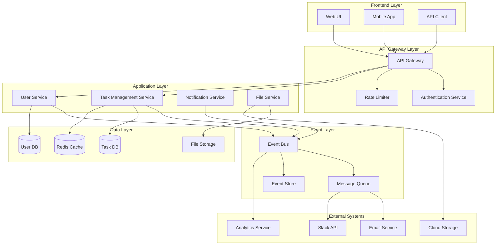

# パラソルV3 MVP 統合仕様書

## 概要

パラソルV3 MVP（タスク管理境界コンテキスト）の外部システム統合、イベント駆動アーキテクチャ、マイクロサービス間連携の仕様書。

## バージョン情報

| 項目 | 内容 |
|------|------|
| バージョン | 1.0 |
| 作成日 | 2024-11-05 |
| 作成者 | Claude Code |
| 対象システム | パラソルV3 MVP - BC-001タスク管理 |
| アーキテクチャ | イベント駆動＋マイクロサービス |

---

## 1. 統合アーキテクチャ概要

### 1.1 統合パターン
- **イベント駆動アーキテクチャ**: ドメインイベントによる疎結合
- **API Gateway**: 外部システムとの統一エンドポイント
- **メッセージキュー**: 非同期処理とリトライ機能
- **サーキットブレーカー**: 外部システム障害時の保護

### 1.2 アーキテクチャ図



---

## 2. ドメインイベント仕様

### 2.1 イベント基本構造

```json
{
  "eventId": "uuid-v4",
  "eventType": "TaskCreated",
  "aggregateId": "task-uuid",
  "aggregateType": "Task",
  "version": 1,
  "timestamp": "2024-11-05T10:30:00Z",
  "correlationId": "correlation-uuid",
  "causationId": "causation-uuid",
  "userId": "user-uuid",
  "data": {
    // イベント固有データ
  },
  "metadata": {
    "source": "task-management-service",
    "traceId": "trace-uuid"
  }
}
```

### 2.2 タスク関連イベント

#### TaskCreated（タスク作成）

```json
{
  "eventType": "TaskCreated",
  "data": {
    "taskId": "task-001",
    "title": "ログイン機能実装",
    "description": "ユーザー認証システムの実装",
    "projectId": "project-001",
    "createdBy": "user-001",
    "priority": "HIGH",
    "dueDate": "2024-11-15",
    "estimatedHours": 16
  }
}
```

#### TaskAssigned（タスクアサイン）

```json
{
  "eventType": "TaskAssigned",
  "data": {
    "taskId": "task-001",
    "assignedUserId": "user-002",
    "assignedBy": "user-001",
    "role": "assignee",
    "dueDate": "2024-11-15"
  }
}
```

#### TaskStatusChanged（ステータス変更）

```json
{
  "eventType": "TaskStatusChanged",
  "data": {
    "taskId": "task-001",
    "previousStatus": "TODO",
    "newStatus": "IN_PROGRESS",
    "changedBy": "user-002",
    "completionRate": 0
  }
}
```

#### TaskCompleted（タスク完了）

```json
{
  "eventType": "TaskCompleted",
  "data": {
    "taskId": "task-001",
    "completedBy": "user-002",
    "actualHours": 18,
    "deliverables": [
      {
        "name": "実装ファイル",
        "url": "/files/implementation.zip"
      }
    ]
  }
}
```

---

## 3. 外部システム統合

### 3.1 通知サービス統合

#### メール通知

**プロバイダー**: SendGrid / AWS SES

**統合方式**: REST API + Webhook

**設定例**:
```yaml
email:
  provider: sendgrid
  apiKey: ${SENDGRID_API_KEY}
  from: noreply@example.com
  templates:
    task_assigned: d-12345678
    task_completed: d-87654321
  webhook:
    endpoint: /webhooks/email-status
    events: [delivered, bounced, opened]
```

**イベントハンドラー**:
```typescript
@EventHandler(TaskAssigned)
async handleTaskAssigned(event: TaskAssigned) {
  const template = 'task_assigned';
  const recipient = await this.userService.findById(event.data.assignedUserId);

  await this.emailService.send({
    to: recipient.email,
    template,
    data: {
      taskTitle: event.data.title,
      dueDate: event.data.dueDate,
      assignedBy: event.data.assignedByName
    }
  });
}
```

#### Slack通知

**統合方式**: Slack Web API + Bot Token

**設定例**:
```yaml
slack:
  botToken: ${SLACK_BOT_TOKEN}
  channels:
    general: "#general"
    development: "#development"
  webhookUrl: ${SLACK_WEBHOOK_URL}
```

**通知例**:
```typescript
@EventHandler(TaskCompleted)
async handleTaskCompleted(event: TaskCompleted) {
  await this.slackService.sendMessage({
    channel: '#development',
    text: `✅ タスク完了: ${event.data.title}`,
    blocks: [
      {
        type: 'section',
        text: {
          type: 'mrkdwn',
          text: `*${event.data.title}* が完了しました\n完了者: <@${event.data.completedBy}>`
        }
      }
    ]
  });
}
```

### 3.2 ファイルストレージ統合

#### AWS S3統合

**設定例**:
```yaml
storage:
  provider: aws-s3
  bucket: task-management-files
  region: ap-northeast-1
  credentials:
    accessKeyId: ${AWS_ACCESS_KEY_ID}
    secretAccessKey: ${AWS_SECRET_ACCESS_KEY}
  presignedUrl:
    expiration: 3600 # 1時間
```

**ファイルアップロード**:
```typescript
@Post('/tasks/:taskId/attachments')
async uploadAttachment(
  @Param('taskId') taskId: string,
  @UploadedFile() file: Express.Multer.File
) {
  const key = `tasks/${taskId}/attachments/${file.originalname}`;

  const uploadResult = await this.s3Service.upload({
    Bucket: 'task-management-files',
    Key: key,
    Body: file.buffer,
    ContentType: file.mimetype
  });

  // イベント発行
  await this.eventBus.publish(new TaskAttachmentUploaded({
    taskId,
    fileName: file.originalname,
    fileUrl: uploadResult.Location,
    uploadedBy: this.currentUser.id
  }));

  return { url: uploadResult.Location };
}
```

### 3.3 分析・監視統合

#### Google Analytics統合

**設定例**:
```yaml
analytics:
  google:
    trackingId: ${GA_TRACKING_ID}
    apiKey: ${GA_API_KEY}
  events:
    task_created: true
    task_completed: true
    user_login: true
```

**イベント送信**:
```typescript
@EventHandler(TaskCreated)
async trackTaskCreated(event: TaskCreated) {
  await this.analyticsService.track({
    event: 'task_created',
    userId: event.data.createdBy,
    properties: {
      taskId: event.data.taskId,
      projectId: event.data.projectId,
      priority: event.data.priority
    }
  });
}
```

---

## 4. マイクロサービス間通信

### 4.1 同期通信（API呼び出し）

#### ユーザーサービス連携

**エンドポイント**: `/api/v1/users/{userId}`

```typescript
@Injectable()
export class UserServiceClient {
  constructor(private httpService: HttpService) {}

  async getUserById(userId: string): Promise<User> {
    try {
      const response = await this.httpService.get(`/users/${userId}`).toPromise();
      return response.data;
    } catch (error) {
      if (error.response?.status === 404) {
        throw new UserNotFoundException(userId);
      }
      throw error;
    }
  }

  async getUsersAvailableForAssignment(criteria: AssignmentCriteria): Promise<User[]> {
    const response = await this.httpService.get('/users/available', {
      params: criteria
    }).toPromise();
    return response.data;
  }
}
```

#### サーキットブレーカー実装

```typescript
@Injectable()
export class CircuitBreakerUserService {
  private circuitBreaker = new CircuitBreaker(this.userServiceClient.getUserById.bind(this.userServiceClient), {
    timeout: 3000,
    errorThresholdPercentage: 50,
    resetTimeout: 30000
  });

  async getUserById(userId: string): Promise<User> {
    try {
      return await this.circuitBreaker.fire(userId);
    } catch (error) {
      // フォールバック処理
      return this.getCachedUser(userId) || this.getDefaultUser();
    }
  }
}
```

### 4.2 非同期通信（イベント駆動）

#### Redis Streams使用例

**設定例**:
```yaml
redis:
  host: localhost
  port: 6379
  streams:
    task_events: task-management-stream
    user_events: user-management-stream
```

**イベント発行**:
```typescript
@Injectable()
export class EventPublisher {
  constructor(private redis: Redis) {}

  async publish(event: DomainEvent): Promise<void> {
    const streamName = this.getStreamName(event.aggregateType);

    await this.redis.xadd(
      streamName,
      '*',
      'eventType', event.eventType,
      'eventId', event.eventId,
      'data', JSON.stringify(event.data),
      'timestamp', event.timestamp
    );
  }
}
```

**イベント購読**:
```typescript
@Injectable()
export class EventSubscriber {
  @Cron('*/5 * * * * *') // 5秒間隔
  async processEvents(): Promise<void> {
    const events = await this.redis.xread(
      'STREAMS', 'task-management-stream', this.lastProcessedId
    );

    for (const event of events) {
      await this.handleEvent(event);
      this.lastProcessedId = event.id;
    }
  }
}
```

---

## 5. API Gateway設定

### 5.1 ルーティング設定

```yaml
# Kong Gateway設定例
routes:
  - name: task-management
    paths: ["/api/v1/tasks"]
    service: task-management-service
    plugins:
      - name: rate-limiting
        config:
          minute: 100
          hour: 1000
      - name: jwt
        config:
          secret_is_base64: false

  - name: user-management
    paths: ["/api/v1/users"]
    service: user-management-service
    plugins:
      - name: cors
        config:
          origins: ["*"]
          methods: ["GET", "POST", "PUT", "DELETE"]
```

### 5.2 認証・認可

#### JWT設定

```typescript
@Injectable()
export class JwtStrategy extends PassportStrategy(Strategy) {
  constructor() {
    super({
      jwtFromRequest: ExtractJwt.fromAuthHeaderAsBearerToken(),
      ignoreExpiration: false,
      secretOrKey: process.env.JWT_SECRET,
    });
  }

  async validate(payload: JwtPayload): Promise<User> {
    const user = await this.userService.findById(payload.sub);
    if (!user || !user.isActive) {
      throw new UnauthorizedException();
    }
    return user;
  }
}
```

#### RBAC実装

```typescript
@Injectable()
export class RoleGuard implements CanActivate {
  constructor(private reflector: Reflector) {}

  canActivate(context: ExecutionContext): boolean {
    const requiredRoles = this.reflector.getAllAndOverride<UserRole[]>(
      'roles',
      [context.getHandler(), context.getClass()]
    );

    if (!requiredRoles) {
      return true;
    }

    const request = context.switchToHttp().getRequest();
    const user = request.user;

    return requiredRoles.some(role => user.roles?.includes(role));
  }
}

// 使用例
@Controller('tasks')
export class TaskController {
  @Post()
  @Roles(UserRole.MANAGER, UserRole.MEMBER)
  @UseGuards(JwtAuthGuard, RoleGuard)
  async createTask(@Body() createTaskDto: CreateTaskDto) {
    return this.taskService.create(createTaskDto);
  }
}
```

---

## 6. 障害対応・レジリエンス

### 6.1 リトライ機能

```typescript
@Injectable()
export class RetryableService {
  @Retryable({
    attempts: 3,
    delay: 1000,
    backoff: BackoffStrategy.EXPONENTIAL
  })
  async callExternalService(data: any): Promise<any> {
    // 外部サービス呼び出し
    return await this.externalClient.send(data);
  }

  @Recover()
  async recover(error: Error, data: any): Promise<any> {
    // リトライ失敗時の処理
    console.error('Failed after retries:', error);
    // デッドレターキューに送信
    await this.deadLetterService.send(data);
    throw error;
  }
}
```

### 6.2 タイムアウト設定

```typescript
@Injectable()
export class TimeoutService {
  @Timeout(5000) // 5秒タイムアウト
  async processTask(taskId: string): Promise<void> {
    // 時間のかかる処理
    await this.heavyProcessing(taskId);
  }

  @TimeoutHandler()
  handleTimeout(taskId: string): void {
    console.error(`Task processing timeout: ${taskId}`);
    // タイムアウト時の処理
    this.scheduleRetry(taskId);
  }
}
```

### 6.3 ヘルスチェック

```typescript
@Controller('health')
export class HealthController {
  constructor(
    private db: DatabaseService,
    private redis: RedisService,
    private external: ExternalServiceClient
  ) {}

  @Get()
  async check(): Promise<HealthStatus> {
    const checks = await Promise.allSettled([
      this.db.ping(),
      this.redis.ping(),
      this.external.healthCheck()
    ]);

    const status = checks.every(check => check.status === 'fulfilled')
      ? 'healthy'
      : 'unhealthy';

    return {
      status,
      timestamp: new Date().toISOString(),
      services: {
        database: checks[0].status === 'fulfilled' ? 'up' : 'down',
        redis: checks[1].status === 'fulfilled' ? 'up' : 'down',
        external: checks[2].status === 'fulfilled' ? 'up' : 'down'
      }
    };
  }
}
```

---

## 7. 監視・ログ

### 7.1 分散トレーシング

**OpenTelemetry設定**:
```typescript
import { NodeSDK } from '@opentelemetry/sdk-node';
import { getNodeAutoInstrumentations } from '@opentelemetry/auto-instrumentations-node';

const sdk = new NodeSDK({
  instrumentations: [getNodeAutoInstrumentations()],
  serviceName: 'task-management-service',
  serviceVersion: '1.0.0',
});

sdk.start();
```

**カスタムスパン**:
```typescript
@Injectable()
export class TaskService {
  constructor(@InjectMetric('task_operations') private metric: Counter) {}

  @Span('create-task')
  async createTask(createTaskDto: CreateTaskDto): Promise<Task> {
    const span = trace.getActiveSpan();
    span?.setAttributes({
      'task.title': createTaskDto.title,
      'task.priority': createTaskDto.priority
    });

    try {
      const task = await this.repository.save(createTaskDto);
      this.metric.inc({ operation: 'create', status: 'success' });
      return task;
    } catch (error) {
      span?.recordException(error);
      this.metric.inc({ operation: 'create', status: 'error' });
      throw error;
    }
  }
}
```

### 7.2 構造化ログ

```typescript
import { Logger } from '@nestjs/common';

@Injectable()
export class TaskService {
  private readonly logger = new Logger(TaskService.name);

  async createTask(createTaskDto: CreateTaskDto): Promise<Task> {
    const correlationId = this.generateCorrelationId();

    this.logger.log({
      message: 'Creating task',
      correlationId,
      userId: this.currentUser.id,
      taskData: {
        title: createTaskDto.title,
        priority: createTaskDto.priority
      }
    });

    try {
      const task = await this.repository.save(createTaskDto);

      this.logger.log({
        message: 'Task created successfully',
        correlationId,
        taskId: task.id,
        duration: Date.now() - startTime
      });

      return task;
    } catch (error) {
      this.logger.error({
        message: 'Failed to create task',
        correlationId,
        error: error.message,
        stack: error.stack
      });
      throw error;
    }
  }
}
```

---

## 8. セキュリティ

### 8.1 API セキュリティ

**CORS設定**:
```typescript
app.use(cors({
  origin: process.env.ALLOWED_ORIGINS?.split(',') || 'http://localhost:3000',
  credentials: true,
  methods: ['GET', 'POST', 'PUT', 'DELETE', 'PATCH'],
  allowedHeaders: ['Content-Type', 'Authorization', 'X-Request-ID']
}));
```

**レート制限**:
```typescript
import rateLimit from 'express-rate-limit';

const limiter = rateLimit({
  windowMs: 15 * 60 * 1000, // 15分
  max: 100, // リクエスト数上限
  message: 'Too many requests from this IP',
  standardHeaders: true,
  legacyHeaders: false,
});

app.use('/api/', limiter);
```

### 8.2 データ検証

```typescript
export class CreateTaskDto {
  @IsString()
  @IsNotEmpty()
  @MaxLength(200)
  title: string;

  @IsString()
  @IsOptional()
  @MaxLength(2000)
  description?: string;

  @IsEnum(Priority)
  priority: Priority;

  @IsUUID()
  projectId: string;

  @IsDateString()
  @IsOptional()
  @IsAfter(new Date())
  dueDate?: string;
}
```

---

## 9. パフォーマンス最適化

### 9.1 キャッシュ戦略

```typescript
@Injectable()
export class CacheService {
  constructor(private redis: Redis) {}

  @Cacheable({
    key: 'user:${userId}',
    ttl: 300 // 5分
  })
  async getUserById(userId: string): Promise<User> {
    return this.userRepository.findById(userId);
  }

  @CacheEvict({
    key: 'user:${user.id}'
  })
  async updateUser(user: User): Promise<User> {
    return this.userRepository.save(user);
  }
}
```

### 9.2 データベース最適化

```typescript
@Injectable()
export class TaskQueryService {
  async getTasksWithPagination(
    filters: TaskFilters,
    pagination: PaginationOptions
  ): Promise<PaginatedResult<Task>> {
    const queryBuilder = this.repository
      .createQueryBuilder('task')
      .leftJoinAndSelect('task.project', 'project')
      .leftJoinAndSelect('task.assignments', 'assignments')
      .where('task.status IN (:...statuses)', { statuses: filters.statuses });

    // インデックス活用のための条件順序最適化
    if (filters.projectId) {
      queryBuilder.andWhere('task.projectId = :projectId', { projectId: filters.projectId });
    }

    if (filters.priority) {
      queryBuilder.andWhere('task.priority = :priority', { priority: filters.priority });
    }

    const [items, total] = await queryBuilder
      .orderBy('task.priority', 'ASC')
      .addOrderBy('task.dueDate', 'ASC')
      .skip(pagination.offset)
      .take(pagination.limit)
      .getManyAndCount();

    return { items, total, ...pagination };
  }
}
```

---

## 10. デプロイ・運用

### 10.1 Docker構成

```dockerfile
# Multi-stage build
FROM node:18-alpine AS builder
WORKDIR /app
COPY package*.json ./
RUN npm ci --only=production

FROM node:18-alpine AS runtime
RUN addgroup -g 1001 -S nodejs
RUN adduser -S nestjs -u 1001
WORKDIR /app
COPY --from=builder /app/node_modules ./node_modules
COPY --chown=nestjs:nodejs . .
USER nestjs
EXPOSE 3000
CMD ["node", "dist/main"]
```

### 10.2 Kubernetes設定

```yaml
apiVersion: apps/v1
kind: Deployment
metadata:
  name: task-management-service
spec:
  replicas: 3
  selector:
    matchLabels:
      app: task-management-service
  template:
    metadata:
      labels:
        app: task-management-service
    spec:
      containers:
      - name: task-management
        image: task-management:latest
        ports:
        - containerPort: 3000
        env:
        - name: DATABASE_URL
          valueFrom:
            secretKeyRef:
              name: database-secret
              key: url
        resources:
          requests:
            memory: "256Mi"
            cpu: "250m"
          limits:
            memory: "512Mi"
            cpu: "500m"
        livenessProbe:
          httpGet:
            path: /health
            port: 3000
          initialDelaySeconds: 30
          periodSeconds: 10
        readinessProbe:
          httpGet:
            path: /health/ready
            port: 3000
          initialDelaySeconds: 5
          periodSeconds: 5
```

---

## 11. 更新履歴

| バージョン | 更新日 | 更新者 | 更新内容 |
|-----------|--------|---------|----------|
| 1.0 | 2024-11-05 | Claude Code | 初版作成 |

---

## 12. 関連ドキュメント

- [ドメイン言語定義書](domain-language.md)
- [API仕様書](api-specification.md)
- [データベース設計書](database-design.md)
- [MVP実装計画書](mvp-implementation-plan.md)