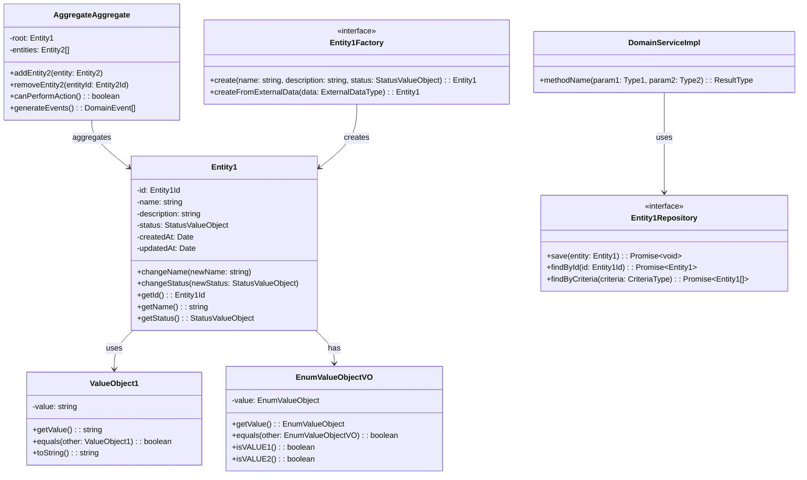

# ドメイン言語定義テンプレート

## BC: [Bounded Context名]

### 概要
[このBounded Contextのドメイン言語の概要説明]

### エンティティ（Entities）

#### [EntityName1]
```typescript
class [EntityName1] {
  // 識別子
  private readonly id: [EntityName1]Id;

  // 属性
  private name: string;
  private description: string;
  private status: [StatusValueObject];
  private createdAt: Date;
  private updatedAt: Date;

  // コンストラクタ
  constructor(
    id: [EntityName1]Id,
    name: string,
    description: string,
    status: [StatusValueObject]
  ) {
    this.id = id;
    this.name = name;
    this.description = description;
    this.status = status;
    this.createdAt = new Date();
    this.updatedAt = new Date();
  }

  // ビジネスメソッド
  public changeName(newName: string): void {
    // ビジネスルール検証
    this.name = newName;
    this.updatedAt = new Date();
  }

  public changeStatus(newStatus: [StatusValueObject]): void {
    // ステータス遷移の検証
    this.status = newStatus;
    this.updatedAt = new Date();
  }

  // ゲッター
  public getId(): [EntityName1]Id { return this.id; }
  public getName(): string { return this.name; }
  public getDescription(): string { return this.description; }
  public getStatus(): [StatusValueObject] { return this.status; }
  public getCreatedAt(): Date { return this.createdAt; }
  public getUpdatedAt(): Date { return this.updatedAt; }
}
```

**責任**: [エンティティの責任範囲]
**ライフサイクル**: [作成→更新→削除のライフサイクル]
**ビジネスルール**:
- [ルール1]
- [ルール2]

#### [EntityName2]
[同様の形式で他のエンティティを定義]

### 値オブジェクト（Value Objects）

#### [ValueObjectName1]
```typescript
class [ValueObjectName1] {
  private readonly value: string;

  constructor(value: string) {
    this.validate(value);
    this.value = value;
  }

  private validate(value: string): void {
    if (!value || value.trim().length === 0) {
      throw new Error('[ValueObjectName1] cannot be empty');
    }
    // その他のバリデーション
  }

  public getValue(): string {
    return this.value;
  }

  public equals(other: [ValueObjectName1]): boolean {
    return this.value === other.value;
  }

  public toString(): string {
    return this.value;
  }
}
```

**制約条件**: [値オブジェクトの制約]
**バリデーション**: [検証ルール]

#### [EnumValueObject]
```typescript
enum [EnumValueObject] {
  [VALUE1] = '[value1]',
  [VALUE2] = '[value2]',
  [VALUE3] = '[value3]'
}

class [EnumValueObject]VO {
  private readonly value: [EnumValueObject];

  constructor(value: [EnumValueObject]) {
    this.value = value;
  }

  public getValue(): [EnumValueObject] {
    return this.value;
  }

  public equals(other: [EnumValueObject]VO): boolean {
    return this.value === other.value;
  }

  public is[VALUE1](): boolean {
    return this.value === [EnumValueObject].[VALUE1];
  }

  public is[VALUE2](): boolean {
    return this.value === [EnumValueObject].[VALUE2];
  }

  public is[VALUE3](): boolean {
    return this.value === [EnumValueObject].[VALUE3];
  }
}
```

### 集約（Aggregates）

#### [AggregateName]集約
```typescript
class [AggregateName]Aggregate {
  // 集約ルート
  private readonly root: [EntityName1];

  // 関連エンティティ
  private entities: [EntityName2][];

  constructor(root: [EntityName1]) {
    this.root = root;
    this.entities = [];
  }

  // 集約の操作
  public add[EntityName2](entity: [EntityName2]): void {
    // ビジネスルール検証
    this.entities.push(entity);
  }

  public remove[EntityName2](entityId: [EntityName2]Id): void {
    // 削除前の整合性チェック
    this.entities = this.entities.filter(e => !e.getId().equals(entityId));
  }

  // 集約の状態確認
  public canPerformAction(): boolean {
    // 集約の状態に基づく判定
    return true;
  }

  // ドメインイベント生成
  public generateEvents(): DomainEvent[] {
    // 状態変更に基づくイベント生成
    return [];
  }

  // ゲッター
  public getRoot(): [EntityName1] { return this.root; }
  public getEntities(): [EntityName2][] { return [...this.entities]; }
}
```

**集約境界**: [集約に含まれるエンティティの範囲]
**整合性ルール**: [集約内で保証される整合性]
**不変条件**: [常に満たされるべき条件]

### ドメインサービス（Domain Services）

#### [DomainServiceName]
```typescript
interface [DomainServiceName] {
  [methodName](param1: Type1, param2: Type2): ResultType;
}

class [DomainServiceName]Impl implements [DomainServiceName] {
  constructor(
    private repository1: [Repository1],
    private repository2: [Repository2]
  ) {}

  public [methodName](param1: Type1, param2: Type2): ResultType {
    // 複数の集約にまたがるビジネスロジック
    // または外部システムとの連携

    return result;
  }
}
```

**責任**: [ドメインサービスの責任範囲]
**利用場面**: [どのような場面で使用されるか]

### ドメインイベント（Domain Events）

#### [DomainEventName]
```typescript
interface [DomainEventName] extends DomainEvent {
  readonly eventType: '[event-type]';
  readonly aggregateId: string;
  readonly occurredAt: Date;
  readonly eventData: {
    [property1]: Type1;
    [property2]: Type2;
  };
}

class [DomainEventName]Impl implements [DomainEventName] {
  public readonly eventType = '[event-type]';
  public readonly aggregateId: string;
  public readonly occurredAt: Date;
  public readonly eventData: {
    [property1]: Type1;
    [property2]: Type2;
  };

  constructor(
    aggregateId: string,
    eventData: {
      [property1]: Type1;
      [property2]: Type2;
    }
  ) {
    this.aggregateId = aggregateId;
    this.eventData = eventData;
    this.occurredAt = new Date();
  }
}
```

**発生タイミング**: [イベントが発生する条件]
**影響範囲**: [このイベントが影響を与える範囲]

### リポジトリインターフェース

#### [EntityName1]Repository
```typescript
interface [EntityName1]Repository {
  // 基本CRUD操作
  save(entity: [EntityName1]): Promise<void>;
  findById(id: [EntityName1]Id): Promise<[EntityName1] | null>;
  findAll(): Promise<[EntityName1][]>;
  delete(id: [EntityName1]Id): Promise<void>;

  // ドメイン固有の検索
  findBy[Criteria](criteria: [CriteriaType]): Promise<[EntityName1][]>;
  findBy[Status](status: [StatusValueObject]): Promise<[EntityName1][]>;

  // 集約の操作
  saveAggregate(aggregate: [AggregateName]Aggregate): Promise<void>;
  findAggregateByRootId(rootId: [EntityName1]Id): Promise<[AggregateName]Aggregate | null>;
}
```

### ファクトリー

#### [EntityName1]Factory
```typescript
interface [EntityName1]Factory {
  create(
    name: string,
    description: string,
    initialStatus: [StatusValueObject]
  ): [EntityName1];

  createFrom[ExternalData](externalData: ExternalDataType): [EntityName1];
}

class [EntityName1]FactoryImpl implements [EntityName1]Factory {
  public create(
    name: string,
    description: string,
    initialStatus: [StatusValueObject]
  ): [EntityName1] {
    const id = new [EntityName1]Id(generateUuid());
    return new [EntityName1](id, name, description, initialStatus);
  }

  public createFrom[ExternalData](externalData: ExternalDataType): [EntityName1] {
    // 外部データからの変換ロジック
    return this.create(
      externalData.name,
      externalData.description,
      new [StatusValueObject]([StatusValueObject].[DEFAULT_VALUE])
    );
  }
}
```

### 仕様（Specifications）

#### [SpecificationName]
```typescript
interface Specification<T> {
  isSatisfiedBy(entity: T): boolean;
  and(other: Specification<T>): Specification<T>;
  or(other: Specification<T>): Specification<T>;
  not(): Specification<T>;
}

class [SpecificationName] implements Specification<[EntityName1]> {
  constructor(private criteria: [CriteriaType]) {}

  public isSatisfiedBy(entity: [EntityName1]): boolean {
    // 仕様の判定ロジック
    return true;
  }

  public and(other: Specification<[EntityName1]>): Specification<[EntityName1]> {
    return new AndSpecification(this, other);
  }

  public or(other: Specification<[EntityName1]>): Specification<[EntityName1]> {
    return new OrSpecification(this, other);
  }

  public not(): Specification<[EntityName1]> {
    return new NotSpecification(this);
  }
}
```

### Mermaidクラス図



### ドメイン用語集

| 用語 | 英語 | 定義 | 備考 |
|------|------|------|------|
| [用語1] | [English1] | [定義1] | [備考1] |
| [用語2] | [English2] | [定義2] | [備考2] |

### ビジネスルール

#### 不変条件（Invariants）
1. **[ルール名1]**: [ルールの詳細説明]
2. **[ルール名2]**: [ルールの詳細説明]

#### 制約条件（Constraints）
1. **[制約名1]**: [制約の詳細説明]
2. **[制約名2]**: [制約の詳細説明]

#### ポリシー（Policies）
1. **[ポリシー名1]**: [ポリシーの詳細説明]
2. **[ポリシー名2]**: [ポリシーの詳細説明]

### 更新履歴
- [日付]: [更新内容] - [更新者]

---

## テンプレート記入例（BC-001: タスク管理）

### エンティティ例

#### Task
```typescript
class Task {
  private readonly id: TaskId;
  private title: string;
  private description: string;
  private status: TaskStatus;
  private priority: Priority;
  private dueDate: Date | null;
  private assigneeId: MemberId | null;
  private createdAt: Date;
  private updatedAt: Date;

  constructor(
    id: TaskId,
    title: string,
    description: string,
    priority: Priority,
    dueDate: Date | null = null
  ) {
    this.validateTitle(title);
    this.id = id;
    this.title = title;
    this.description = description;
    this.status = new TaskStatus(TaskStatusEnum.TODO);
    this.priority = priority;
    this.dueDate = dueDate;
    this.assigneeId = null;
    this.createdAt = new Date();
    this.updatedAt = new Date();
  }

  public assignTo(assigneeId: MemberId): void {
    this.assigneeId = assigneeId;
    this.updatedAt = new Date();
  }

  public startWork(): void {
    if (!this.status.isTodo()) {
      throw new Error('Task must be in TODO status to start work');
    }
    this.status = new TaskStatus(TaskStatusEnum.IN_PROGRESS);
    this.updatedAt = new Date();
  }

  public complete(): void {
    if (!this.status.isInProgress()) {
      throw new Error('Task must be in progress to complete');
    }
    this.status = new TaskStatus(TaskStatusEnum.DONE);
    this.updatedAt = new Date();
  }

  private validateTitle(title: string): void {
    if (!title || title.trim().length === 0) {
      throw new Error('Task title cannot be empty');
    }
    if (title.length > 100) {
      throw new Error('Task title cannot exceed 100 characters');
    }
  }

  // ゲッター省略...
}
```