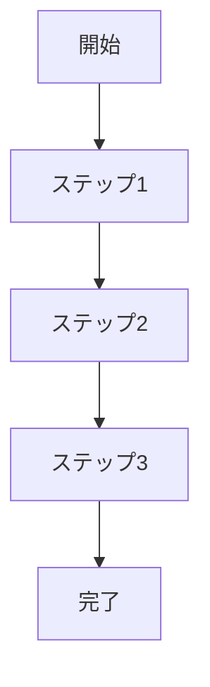
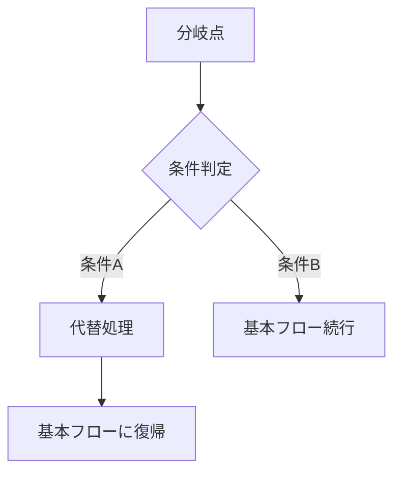
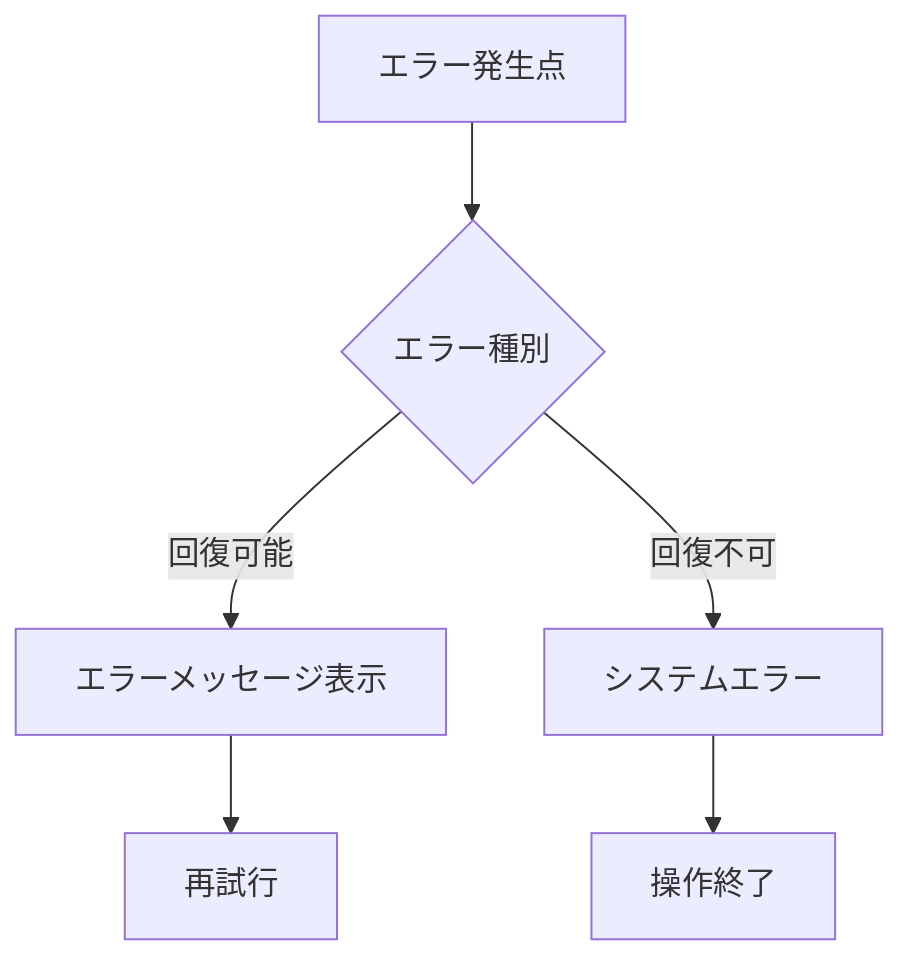

# Operation設計テンプレート

## Operation ID: op-XXX-[operation-name]

### 基本情報
- **Operation名**: [操作名]
- **所属Capability**: [cap-XXX] [Capability名]
- **所属BC**: [Bounded Context名]
- **操作タイプ**: [Command/Query/Event]
- **ビジネス価値**: [この操作が提供するビジネス価値]

### 概要
[この操作の概要説明。何を実現し、どのような価値を提供するかを記述]

### 操作の詳細

#### 目的
[この操作の目的と期待される成果]

#### スコープ
- **含む**: [この操作に含まれる処理範囲]
- **含まない**: [この操作に含まれない処理範囲]

#### トリガー
- **手動トリガー**: [ユーザーアクション]
- **自動トリガー**: [システムイベント]
- **スケジュールトリガー**: [定期実行]

### ステークホルダー

#### プライマリアクター
- **ロール**: [主要実行者の役割]
- **責任**: [実行者の責任範囲]
- **権限**: [必要な権限レベル]

#### セカンダリアクター
- **システム**: [関連するシステム]
- **外部サービス**: [連携する外部サービス]

#### 受益者
- [この操作から恩恵を受ける人・組織]

### プロセスフロー

#### 基本フロー

1. **[ステップ1]**: [処理内容]
   - 入力: [必要な入力データ]
   - 処理: [実行する処理]
   - 出力: [生成される出力]

2. **[ステップ2]**: [処理内容]
   - 入力: [必要な入力データ]
   - 処理: [実行する処理]
   - 出力: [生成される出力]

3. **[ステップ3]**: [処理内容]
   - 入力: [必要な入力データ]
   - 処理: [実行する処理]
   - 出力: [生成される出力]

#### 代替フロー1: [条件の説明]

- **分岐点**: 基本フロー ステップX
- **条件**: [分岐条件の詳細]
- **代替処理**: [実行する代替処理]

#### 例外フロー1: [エラー条件の説明]

- **発生点**: 基本フロー ステップX
- **条件**: [エラー発生条件]
- **対処**: [エラー対処方法]

### データ仕様

#### 入力データ
| 項目名 | 型 | 必須 | 説明 | 制約 |
|-------|----|----|------|------|
| [項目1] | [型] | [○/×] | [説明] | [制約条件] |
| [項目2] | [型] | [○/×] | [説明] | [制約条件] |

#### 出力データ
| 項目名 | 型 | 説明 | 備考 |
|-------|----|----|------|
| [項目1] | [型] | [説明] | [備考] |
| [項目2] | [型] | [説明] | [備考] |

#### 内部データ
| 項目名 | 型 | 説明 | ライフサイクル |
|-------|----|----|------------|
| [項目1] | [型] | [説明] | [作成〜削除] |
| [項目2] | [型] | [説明] | [作成〜削除] |

### ビジネスルール

#### 必須ルール
1. **[ルール1名]**: [ルールの詳細説明]
2. **[ルール2名]**: [ルールの詳細説明]

#### 制約条件
1. **[制約1名]**: [制約の詳細説明]
2. **[制約2名]**: [制約の詳細説明]

#### バリデーション
1. **[バリデーション1]**: [検証ルール]
2. **[バリデーション2]**: [検証ルール]

### 品質要求

#### パフォーマンス
- **応答時間**: [秒以内]
- **スループット**: [件/時間]
- **同時実行数**: [件]

#### 可用性
- **稼働率**: [%]
- **復旧時間**: [分以内]

#### セキュリティ
- **認証要求**: [認証レベル]
- **認可要求**: [権限レベル]
- **データ保護**: [暗号化要求]

### UseCase関連

#### 関連UseCase
| UseCase ID | UseCase名 | 関係 | 説明 |
|-----------|----------|------|------|
| [uc-XXX] | [UseCase名] | [includes/extends/uses] | [関係の説明] |

#### 実現するUseCase
- **[uc-XXX]**: [UseCase名] - [実現内容]

### 実装指針

#### 技術要求
- **使用技術**: [技術スタック]
- **フレームワーク**: [使用フレームワーク]
- **ライブラリ**: [必要なライブラリ]

#### アーキテクチャ
- **パターン**: [適用するパターン]
- **層構造**: [層の構成]

#### 実装の考慮事項
1. **[考慮事項1]**: [詳細説明]
2. **[考慮事項2]**: [詳細説明]

### テスト設計

#### テストシナリオ
1. **正常系テスト**: [テスト内容]
2. **異常系テスト**: [テスト内容]
3. **境界値テスト**: [テスト内容]

#### テストデータ
- **正常データ**: [テストデータの例]
- **異常データ**: [テストデータの例]

### メトリクス

#### ビジネスメトリクス
- **成功指標**: [指標名] - 目標値: [値]
- **効率指標**: [指標名] - 目標値: [値]

#### 技術メトリクス
- **パフォーマンス**: [指標名] - 目標値: [値]
- **品質指標**: [指標名] - 目標値: [値]

### 依存関係

#### 前提条件
- [前提条件1]
- [前提条件2]

#### 他のOperationとの関係
- **依存Operation**: [op-XXX] - [依存理由]
- **後続Operation**: [op-XXX] - [関係の詳細]

### リスクと対策

#### 特定されたリスク
1. **[リスク1]**: [リスクの説明] - 対策: [対策内容]
2. **[リスク2]**: [リスクの説明] - 対策: [対策内容]

### 更新履歴
- [日付]: [更新内容] - [更新者]

---

## テンプレート記入例

### Operation ID: op-001-create-task

#### 基本情報
- **Operation名**: タスク作成
- **所属Capability**: cap-001-task-lifecycle タスクライフサイクル管理能力
- **所属BC**: BC-001 タスク管理
- **操作タイプ**: Command
- **ビジネス価値**: 新しいタスクを適切に定義し、プロジェクトの進行を開始する

#### 概要
プロジェクトの作業を具体的なタスクとして定義し、必要な情報を設定してチームでの実行を可能にする操作。

#### 目的
- 作業内容を明確化し、実行可能な単位に分割する
- タスクの優先度と期限を設定し、プロジェクト全体の計画に組み込む
- 適切な情報を提供し、担当者が効率的に作業を開始できる状態を作る