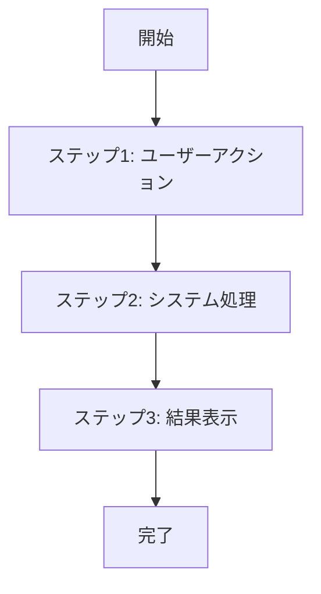
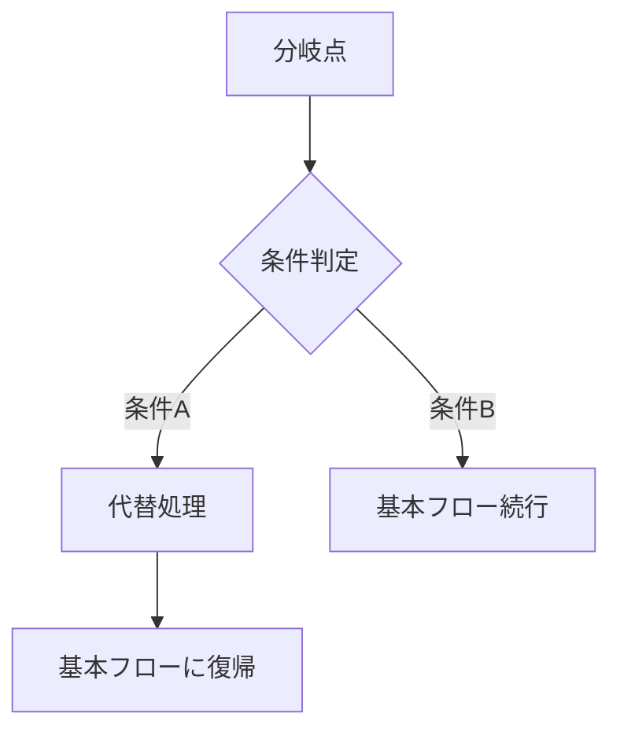
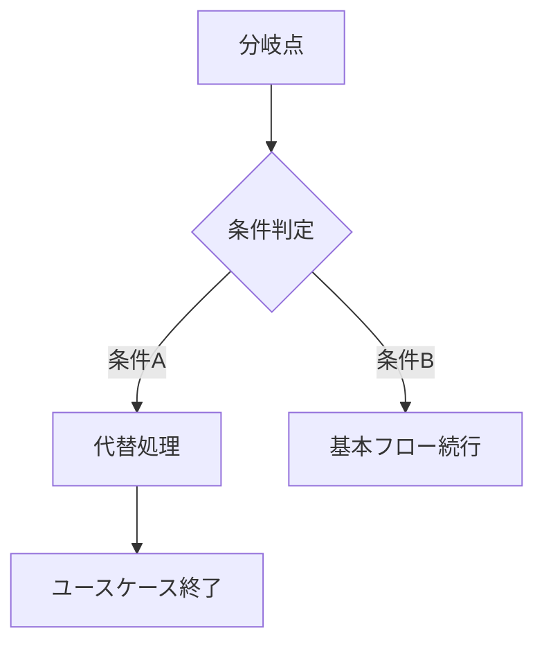
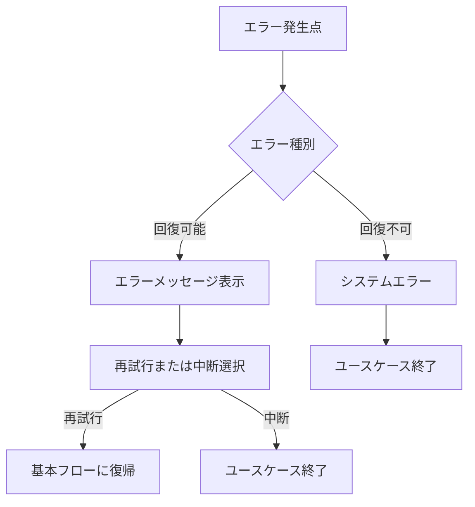

# UseCase設計テンプレート

## UseCase ID: uc-XXX-[usecase-name]

### 基本情報
- **UseCase名**: [ユースケース名]
- **関連Operation**: [op-XXX] [Operation名]
- **関連Page**: [page-XXX] [Page名]
- **所属BC**: [Bounded Context名]
- **カテゴリ**: [CRUD/Workflow/Analytics/Communication/Administration]

### 概要
[このユースケースの概要説明。ユーザーの視点から、何を達成するかを記述]

### ユースケース詳細

#### 目的
[このユースケースの目的と期待される成果]

#### プライマリアクター
- **ロール**: [主要実行者の役割]
- **動機**: [実行する動機・理由]
- **期待値**: [期待する成果]

#### セカンダリアクター
- **システム**: [関連するシステム]
- **外部アクター**: [関連する外部システム・人]

#### ステークホルダー
- **受益者**: [恩恵を受ける人・組織]
- **関係者**: [影響を受ける人・組織]

### 前提条件
- [前提条件1]: [詳細説明]
- [前提条件2]: [詳細説明]

### 成功時の事後条件
- [事後条件1]: [詳細説明]
- [事後条件2]: [詳細説明]

### 失敗時の事後条件
- [失敗時の状態1]: [詳細説明]
- [失敗時の状態2]: [詳細説明]

### フロー設計

#### 基本フロー

1. **ユーザーアクション**: [アクターが実行するアクション]
   - 入力: [ユーザーが提供する情報]
   - 操作: [ユーザーが行う操作]

2. **システム処理**: [システムが実行する処理]
   - 検証: [入力データの検証]
   - 処理: [ビジネスロジックの実行]
   - 保存: [データの永続化]

3. **結果表示**: [ユーザーへの結果提示]
   - 成功メッセージ: [成功時の表示]
   - 確認画面: [結果確認画面]

#### 代替フロー1: [条件の説明]

- **分岐点**: 基本フロー ステップX
- **条件**: [分岐する条件の詳細]

**代替手順**:
1. [代替ステップ1]: [処理内容]
2. [代替ステップ2]: [処理内容]
3. 基本フロー ステップYに復帰

#### 代替フロー2: [条件の説明]

- **分岐点**: 基本フロー ステップX
- **条件**: [分岐する条件の詳細]

**代替手順**:
1. [代替ステップ1]: [処理内容]
2. [代替ステップ2]: [処理内容]
3. ユースケース終了

#### 例外フロー1: [エラー条件の説明]

- **発生点**: 基本フロー ステップX
- **条件**: [エラー発生条件]

**例外対応手順**:
1. [例外対応1]: [対応内容]
2. [例外対応2]: [対応内容]
3. [回復方法]: [回復処理]

### UI/UX設計

#### 画面構成
- **メイン画面**: [画面の目的と構成]
- **入力フォーム**: [フォームの項目と配置]
- **確認画面**: [確認内容と操作]
- **結果画面**: [結果表示の内容]

#### ユーザーインタラクション
1. **入力段階**: [ユーザーの入力方法]
2. **確認段階**: [確認の流れ]
3. **実行段階**: [実行時のフィードバック]
4. **完了段階**: [完了時の表示]

#### レスポンシブ対応
- **デスクトップ**: [デスクトップでの表示・操作]
- **タブレット**: [タブレットでの表示・操作]
- **モバイル**: [モバイルでの表示・操作]

### データ仕様

#### 入力データ
| 項目名 | 型 | 必須 | 説明 | バリデーション | UI要素 |
|-------|----|----|------|-------------|-------|
| [項目1] | [型] | [○/×] | [説明] | [バリデーションルール] | [入力要素] |
| [項目2] | [型] | [○/×] | [説明] | [バリデーションルール] | [入力要素] |

#### 出力データ
| 項目名 | 型 | 説明 | 表示形式 |
|-------|----|----|-------|
| [項目1] | [型] | [説明] | [表示方法] |
| [項目2] | [型] | [説明] | [表示方法] |

#### 状態データ
| 状態名 | 説明 | 遷移条件 |
|-------|------|--------|
| [状態1] | [状態の説明] | [遷移する条件] |
| [状態2] | [状態の説明] | [遷移する条件] |

### ビジネスルール

#### バリデーションルール
1. **[ルール1名]**: [バリデーションの詳細]
2. **[ルール2名]**: [バリデーションの詳細]

#### ビジネス制約
1. **[制約1名]**: [制約の詳細説明]
2. **[制約2名]**: [制約の詳細説明]

#### 権限制御
- **実行権限**: [必要な権限レベル]
- **データアクセス権限**: [アクセス可能なデータ範囲]

### 品質要求

#### ユーザビリティ
- **学習容易性**: [新規ユーザーが理解するまでの時間]
- **効率性**: [タスク完了までの操作数]
- **満足度**: [ユーザー満足度の目標]

#### パフォーマンス
- **応答時間**: [画面表示・処理完了時間]
- **スループット**: [同時利用可能ユーザー数]

#### アクセシビリティ
- **WCAG準拠レベル**: [AA/AAA]
- **支援技術対応**: [スクリーンリーダー等の対応]

### テスト設計

#### 受け入れテスト
1. **正常系シナリオ**: [テストシナリオ]
2. **異常系シナリオ**: [テストシナリオ]
3. **境界値シナリオ**: [テストシナリオ]

#### ユーザビリティテスト
- **タスク完了率**: [目標値]
- **エラー発生率**: [目標値]
- **ユーザー満足度**: [目標値]

#### テストデータ
- **正常データセット**: [データの説明]
- **異常データセット**: [データの説明]
- **境界値データセット**: [データの説明]

### 依存関係

#### 前提システム
- **[システム1]**: [依存内容]
- **[システム2]**: [依存内容]

#### 関連UseCase
| UseCase ID | UseCase名 | 関係 | 説明 |
|-----------|----------|------|------|
| [uc-XXX] | [UseCase名] | [includes/extends/precedes/follows] | [関係の説明] |

#### 外部連携
- **[外部システム1]**: [連携内容]
- **[外部システム2]**: [連携内容]

### 非機能要求

#### セキュリティ
- **認証**: [認証方式]
- **認可**: [認可レベル]
- **データ保護**: [暗号化・匿名化要求]

#### 可用性
- **稼働率**: [目標稼働率]
- **復旧時間**: [障害復旧時間]

#### 運用性
- **監視項目**: [監視すべき項目]
- **ログ出力**: [ログの内容・レベル]

### メトリクス

#### ビジネスメトリクス
- **利用率**: [目標利用率]
- **成功率**: [タスク成功率の目標]
- **満足度**: [ユーザー満足度の目標]

#### 技術メトリクス
- **応答時間**: [目標応答時間]
- **エラー率**: [目標エラー率]
- **可用性**: [目標可用性]

### 更新履歴
- [日付]: [更新内容] - [更新者]

---

## テンプレート記入例

### UseCase ID: uc-001-task-creation

#### 基本情報
- **UseCase名**: 新規タスク作成
- **関連Operation**: op-001-create-task タスク作成
- **関連Page**: page-001-task-creation タスク作成ページ
- **所属BC**: BC-001 タスク管理
- **カテゴリ**: CRUD

#### 概要
プロジェクトマネージャーまたはチームリーダーが、新しい作業タスクを作成し、プロジェクトの進行に必要な作業単位を定義するユースケース。

#### 目的
- プロジェクトの作業を具体的で実行可能なタスクに分割する
- タスクの詳細情報、優先度、期限を適切に設定する
- チームメンバーが理解しやすい形でタスクを定義する

#### プライマリアクター
- **ロール**: プロジェクトマネージャー、チームリーダー
- **動機**: プロジェクトを計画通りに進行させるため
- **期待値**: 明確で実行可能なタスクの作成